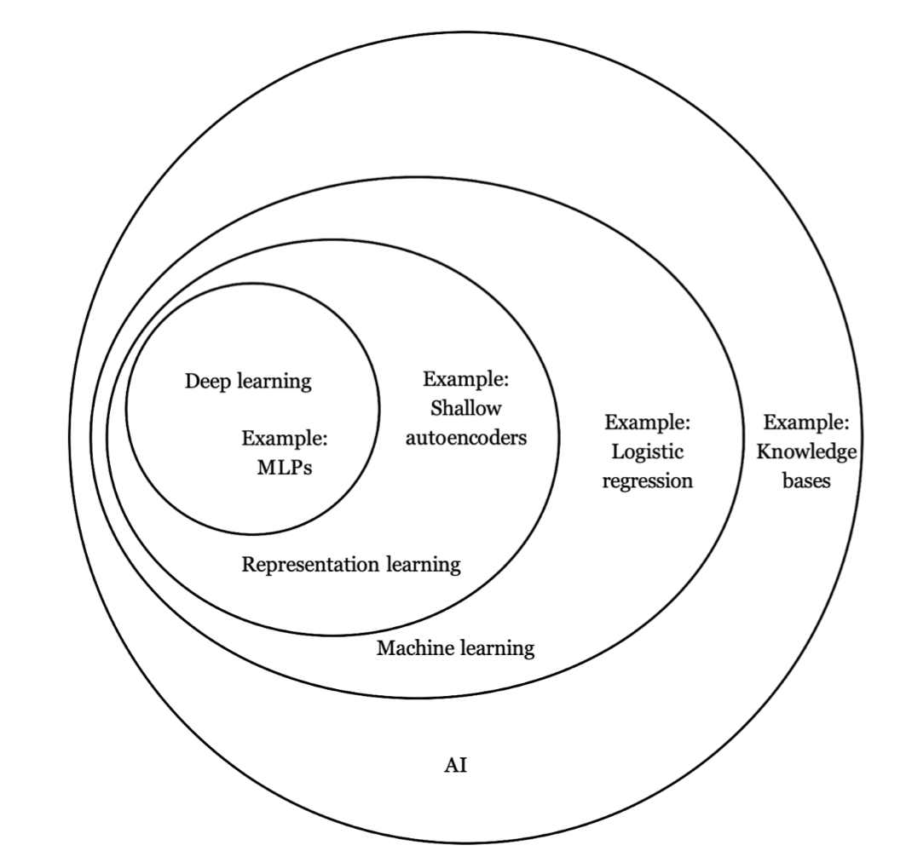
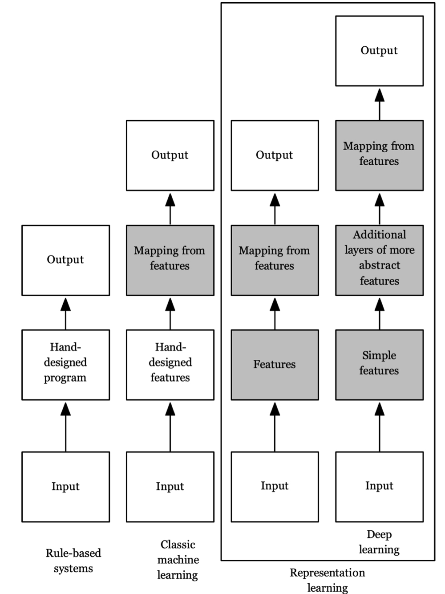
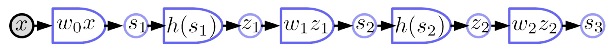
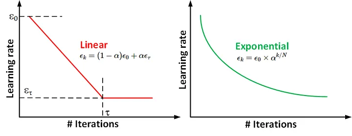
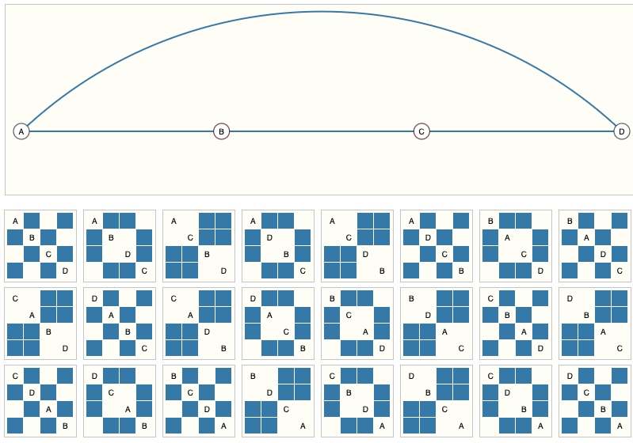
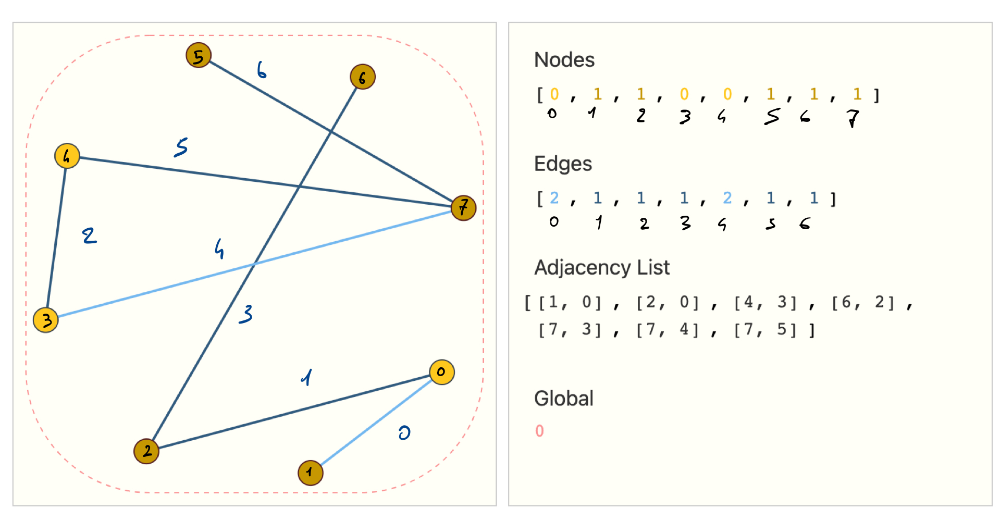
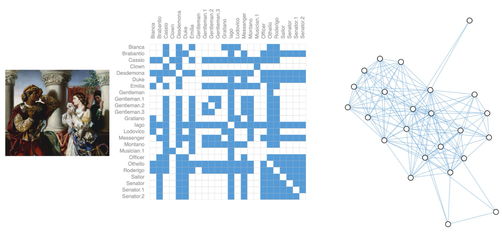
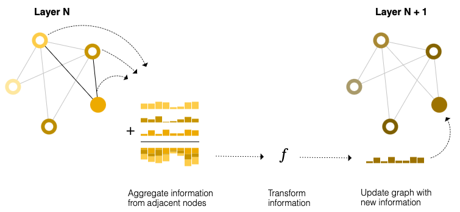

<aside>
⚠️ Purple sections are AI-generated
</aside>
<aside>
⚠️ Green sections are deep divings
</aside>
# Repositories
https://distill.pub/
# Milestones
1997 - Deep Blue (IBM)
2011 - Watson (IBM)
2016 - AlphaGo (Google DeepMind)
2017 - AlphaZero (Google DeepMind)
2017 - StarCraft II AI (Google DeepMind x Blizzard)
2019 - AlphaStar (Google DeepMind)
2019 - OpenAI five
2020 - AlphaFolde 2 (Google DeepMind)
2020 - BERT (Google)
2021 - Dall-E (OpenAI)
2022 - ChatGPT (OpenAI)
2023 - Bard (Google)
2023 - Gemini (Google)
# 1. Introduction

In general, it is not that easy stating whether a model is doing a ML or DL task. The main difference between ML and DL is that DL models do not require human intervention to extract features: this is done automatically. This is defined **Representation Learning**, where models creates features by themselves, starting from simpler and abstracting them to more complex ones.

*Grey blocks: learning processes*

## Computational Graphs
It is a directed graph where:
* **nodes** are mathematical operations or variables
* **edges** represent data flow. 
Graphs can help in understanding how to optimize the whole computation by parallelizing calculations on different hardware components.
### Block diagram notation
**Variables**

**Observed variable**: input, desired output, etc.

**Computed variable**: output of deterministic functions (see below)

**Deterministic function**: 
multiple inputs and multiple outputs
implicit parameter variable

**Scalar-valued function**: 
single scalar output
(used mostly for cost functions)

### Parameterized Machine Learning Model
Here is an example of a simple ML model $G$, represented with a computation graph.

$$
\bar y = G(x, w)
$$

The idea is that both $x$’s and $y$’s are inputs for the process that aims at training the system at lowering the cost function defined.

In general, what we do is calculating losses using $y$’s and then perform backpropagation to adjust model’s weight; it is known as *backpropagation towards x*.
However, given that also $y$’s are inputs, even *backpropagation towards y* is possible. 
==#TODO:  backpropagation towards y==
### Forward and Backward propagation with diagrams

### Neural Networks with Block diagrams

## Machine Learning vs Deep Learning

Hand-engineered feature extraction

Multi-layer feature automatic extraction: from lower-level features (es. pixel) to abstracted 

$x$ was the input while $y$ was considered an output, used to compute the cost function.

Both $x$ and $y$ are inputs and errors can be backpropagated towards both.

Gradient Descent can be applied in all its flavors.

Gradient Descent is not that practical to use, because of the milions features involved.
Mini-batched are often used to enable parallelization.

> [!NOTE] ⚠️ **Practical hints**
> - use ReLU (widely used for DL models)
> - always shuffle data
> - normalize data (to prevent learning rate problems due to different data scales)
> - use SGD on mini-batches
> - use regulation (L1 or L2 or a combination)
> - use [[#Dropout]] layers
> - use cross-entropy loss for classification tasks
# 2. Basic Architectures
==#TODO ==
## Multiplicative Modules
==#TODO ==
## Mixture of Experts
==#TODO ==
## Parameter Transformations
==#TODO ==
### Shared Weights
==#TODO ==
# 3. Learning Representations

> ![[Example-of-application-of-the-Covers-theorem-Linear-inseparable-data-become-separable.ppm.png|400]]
> The probability that a dichotomy over P points in N dimensions is linearly separable goes to zero as P gets larger than N.
> \[*Cover’s theorem, 1966*\]

This means that when the number of data points available P is larger than dimensions considered N, the points arrangement could get so complex that is not linearly separable.
To fix the problem, more dimensions should be considered (increase N w.r.t. P).

**Example:** $N=2$
* $P=2$: i can always separate two points with a line
* $P=3$: i can still separate all points in two classes with a single line
* $P \ge 4$: i could not be possible (e.g. the point to separate is in the middle)

This brief discussion wants to enhance the linear classifiers limitations. This is why non-linear models are usually involved to achieve complex classification tasks; <u>non-linearity allows escaping from the Cover’s Theorem Problem.</u>
## Deep Architectures
The idea is to train complex models to extract relevant features from the raw inputs (like images).

Using complex models (very high dimensionality) means following this basic principle: expanding the number of dimensions of the representations makes data more likely to be linearly separable.
Some implementations are:
* space tiling
* random projections
* polynomial classifier
	* **monomial features**: the feature extractor computes cross products of input variables (features), to obtain new features as linear combination of initial ones
* radial basis functions
* kernel machines
We need something more than just linear classifiers; NNs can be a solution.

> **Shallow NNs** can be considered as universal approximators (of continuous functions), even with just two layers of reasonable size.
> *\[Cybenko’s Theorem, 1988\]*
### Deep Neural Networks
So, <u>why do we need deep architectures?</u>
* are **more efficient** at representing (approximating) certain classes of functions, like ones used in visual recognition
* more complex functions can be represented with less modules, so **less hardware needed**
* they **trade space for time**

Input data is embedded into higher dimensional spaces (**latent space**): this could make things separable, when they were not before.
Once that data have been expanded (dimension-wise), some operations can be performed, such as **pooling** and **aggregation**.

We want to build machines able to discover hidden structures in high-dimentional data, like data that can be found in nature, in order to represent thinks like an human would do.

> Natural data lives in a low-dimensional, non-linear, manifold (i.e. a simpler sub-space within a global hidden space).
> *\[Manifold Hypothesis, ~1990\]*
## Multi-layer Architecture
The idea is to build machines that automatically learn features, in a stratified fashion: starting from the low-level to the highest level ones; this can be defined as a <u>hierarchical feature representation with increasing level of abstraction</u>.

Some examples can be:
* Image recognition
  pixel → Edge → texton → motif → part → object
* Text
  character → word → word group → clause → sentence → story
* Speech
  sample → spectral band → sound → phone → phoneme → word
## Why does deep architecture work?
<u>They trade space for time</u>: better in case of machines with limited memory, like computers.
In brief, more layers → more computation, less hardware.
# 4. Activation Functions
Activation functions are fundamental in deep neural networks: they are the <u>founding block that allows the non-linear behavior of the models</u>.

There exists a variety of activation functions, that can be grouped in:
- **saturating activations**: functions that squeeze the input into a fixed (bounded) interval
- **non-saturating activations**: functions that can grow to infinity in at least one direction

Saturation is undesirable in deep neural networks because can lead to the vanishing gradients problem.
## Vanishing Gradients
This problem occurs - mainly - when saturating non-linearities (activation functions) are used.

When a saturating activation function gets an high input ($>2.5$ for sigmoid, like in figure), then it means that it’s operating in its saturating area, where the derivative is close to 0.

Backpropagation, used for learning, is based on the concept of derivatives. When derivatives are close to zero, backpropagation will work very slowly, especially in deep neural networks where the backpropagated information (gradients) could get smaller, layer after layer. 

In practical terms, <u>the vanishing gradients problem leads to a very slow learning process.</u>

There are several ways to prevent this problem:
- use [[#Non-saturating activations]]
- use [[#Batch Normalization]]
- [[#Initialize weights (Xavier Initialization)]] properly
- use Gradient Clipping
## Non-saturating activations
### ReLU
#MEM
$$\mathrm{ReLU}(x)=max(0,x)$$
![[Pasted image 20250330182147.png|450]]
### LeakyReLU
#MEM
$$
\mathrm{LeakyReLU}(x)=
\begin{cases}
x & \text{if } x\ge 0\\
a_{neg\_slope} \cdot x & \text{otherwise}
\end{cases}
$$
![[LeakyReLU.png | 450]]
### PReLU
#MEM
$$
\mathrm{PReLU}(x)=
\begin{cases}
x & \text{if } x\ge 0 \\
a \cdot x & \text{otherwise}
\end{cases}
$$
Where $a$ is a learnable parameter
![[Pasted image 20250330182244.png|450]]
### RReLU
#MEM
$$
\mathrm{RReLU}(x)=
\begin{cases}
x & \text{if } x\ge 0 \\
a \cdot x & \text{otherwise}
\end{cases}
$$
Where $a$ is a random variable that:
* \[training\] keeps sampling in the range $[lower, upper]$
* \[testing\] remains fixed
![[Pasted image 20250330182307.png|450]]
### ELU
#MEM
$$
\mathrm{ELU}(x)=
\begin{cases}
x & \text{if } x > 0 \\
\alpha \cdot (e^x-1) & \text{if } x \le 0
\end{cases}
$$
![[Pasted image 20250330201014.png|450]]
### Softplus
$$
\mathrm{Softplus}(x)=\frac{1}{\beta} \cdot \log(1+e^{(\beta \cdot x)})
$$
Where:
* (a large) $\beta$ makes Softplus more similar to [[#ReLU]]
* $threshold$ (function parameter) is used for numerical stability. It reverts to the *linear function* when $input \cdot \beta > threshold$
SoftPlus is a smooth approximation to the ReLU function and can be used to constrain the output of a machine to always be positive.
![[Pasted image 20250330210133.png|450]]
### CELU
$$
\mathrm{CELU}(x)=
\begin{cases}
x & \text{if } x > 0 \\
\alpha \cdot \exp(\frac{x}{\alpha}-1) & \text{if } x \le 0
\end{cases}
$$
![[Pasted image 20250330211318.png|450]]
### SELU
$$
\mathrm{SELU}(x)=
\begin{cases}
scale \cdot x & \text{if } x > 0 \\
scale \cdot \alpha \cdot (e^x - 1) & \text{if } x \le 0
\end{cases}
$$
Where:
* $\alpha = 1.6732632423543772848170429916717$
* $scale=1.0507009873554804934193349852946$
![[Pasted image 20250330211419.png|450]]
### GELU
$$
\mathrm{GELU}(x) = x \cdot \Phi(x)
$$
Where:
* $\Phi(x)$ is the Cumulative Distribution Function for a Gaussian Distribution

> [!NOTE] 💡
> Note that GELU is non-monotonic.

![[Pasted image 20250330211639.png|450]]
### ReLU6
$$
\mathrm{ReLU6}(x)= \min(\max(0,x),6)
$$
![[Pasted image 20250331125400.png|450]]
## Saturating activations
### Sigmoid
#MEM
$$
\mathrm{Sigmoid}(x)=\sigma(x)= \frac{1}{1+e^{-x}}
$$
![[Pasted image 20250331125635.png|450]]
Stacking a big number of sigmoids (e.g. in deep NNs) leads to [[#Vanishing Gradients]].
So, especially for deep NNs, single kink functions (such as [[#ReLU]]) are preferred.
### Tanh
#MEM
$$
\mathrm{Tanh}(x)=\mathrm{\tanh}(x)=\frac{e^x-e^{-x}}{e^x+e^{-x}}
$$
![[Pasted image 20250331142334.png|450]]
It is very similar to [[#Sigmoid]], but has 0 mean.
### Softsign
#MEM
$$
\mathrm{SoftSign}(x)=\frac{x}{1+|x|}
$$
![[Pasted image 20250331142421.png|450]]
### Hardtanh
#MEM
$$
\mathrm{HardTanh}(x)=
\begin{cases}
\mathrm{max\_val} & \text{if } x > \mathrm{max\_val} \\
\mathrm{min\_val} & \text{if } x < \mathrm{min\_val} \\
x & \text{otherwise}
\end{cases}
$$
![[Pasted image 20250331143803.png|450]]
> [!NOTE] 💡
> Works very well when weight are kept within the small value range.
### Threshold
$$
\mathrm{threshold}(x)=
\begin{cases}
x & \text{if } x > threshold \\
value & \text{otherwise}
\end{cases}
$$
> [!NOTE] ⚠️
> No more used!
### Tanhshrink
$$
\mathrm{Tanhshrink}(x)=x-\tanh(x)
$$
![[Pasted image 20250331144143.png|450]]
### Softshrink
$$
\mathrm{SoftShrink}(x)=
\begin{cases}
x - \lambda & \text{if } x > \lambda \\
x + \lambda & \text{if } x < -\lambda \\
0 & \text{otherwise}
\end{cases}
$$
![[Pasted image 20250331144611.png|450]]
### Hardshrink
$$
\mathrm{HardShrink}(x)=
\begin{cases}
x & \text{if } x > \lambda \\
x & \text{if } x < -\lambda \\
0 & \text{otherwise}
\end{cases}
$$
![[Pasted image 20250331144645.png|450]]
### LogSigmoid
$$
\mathrm{LogSigmoid}(x)=\log\left( \frac{1}{1+e^{-x}} \right)
$$
![[Pasted image 20250331144701.png|450]]
## Softmin
#MEM
$$
\mathrm{Softmin}(x_{i})=\frac{e^{-x_{i}}}{\sum_{j}e^{-x_{j}}}
$$
Where:
* $x_i$ is the element of an array of values
Rescales the elements of $x$ so that the elements of the n-dimensional output Tensor lie in the range [0,1] and sum to 1.
Softmin tends to activate more the lowest values.

**Example**
$x=[1,2,3]$
$\mathrm{Softmin(x)}:[0.66524096, 0.24472847, 0.09003057]$
## Softmax
#MEM
$$
\mathrm{Softmax}(x_{i})=\frac{e^{x_{i}}}{\sum_{j}e^{x_{j}}}
$$
Where:
* $x_i$ is the element of an array of values
Rescales the elements of $x$ so that the elements of the n-dimensional output Tensor lie in the range \[0,1] and sum to 1.
Softmax tends to activate more the highest values.

**Example**
$x=[1,2,3]$
$\mathrm{Softmax(x)}:[0.09003057, 0.24472847, 0.66524096]$
## LogSoftmax
#MEM
$$
\mathrm{LogSoftmax}(x_{i})=\log \left( \frac{e^{x_{i}}}{\sum_{j}e^{x_{j}}} \right)
$$
It is not generally used as activation function, but as a component in other loss functions.
# 5. Loss Functions
Here are listed some of the most used losses in Deep Learning.
Specific loss functions are used for specific tasks, such as regression and classification ones.
## Regression losses
### Mean Squared Error (L2 loss)
#MEM
[ between each element in the input $x$ and target $y$.

MSE can be intended as **unreduced** (a vector is returned):
$$
l(x,y)=L=\{l_{1,\dots,l_{N}}\}^T
\quad \text{with} \quad
l_{n}=(x_{n}-y_{n})^2
$$
MSE can be also intended as **reduced** (a scalar is returned):
$$
l(x,y)=
\begin{cases}
mean(L) & \text{if reduction = "mean"} \\
sum(L) & \text{if reduction = "sum"} \\
\end{cases}
$$
### Mean Absolute Error (L1 loss)
#MEM 
This measures the mean absolute error (MAE) between each element in the input $x$ and target $y$.

MAE can be intended as **unreduced** (a vector is returned):
$$
l(x,y)=L=\{l_{1,\dots,l_{N}}\}^T
\quad \text{with} \quad
l_{n}=|x_{n}-y_{n}|
$$
MAE can be also intended as **reduced** (a scalar is returned) using `mean` or `sum`.

> [!NOTE] 💡
> It is more robust to outliers and noise than [[#Mean Squared Error (L2 loss)]] (MSE squares the errors, so it is more sensitive)

> [!NOTE] ⚠️
> L1 loss is not differentiable at the bottom 0.
### Smooth Mean Absolute Error (smooth L1 loss)
$$
l(x,y)=\frac{1}{n} \sum_{i} z_{i}
\quad \text{with} \quad
z_{i}
\begin{cases}
0.5(x_{i}-y_{i})^2 & \text{if } |x_{i}-y_{i}|<1 \\
|x_{i}-y_{i}|-0.5 & \text{otherwise} \\
\end{cases}
$$
![[13bR2Pe64jdVht0LbqhssNA.png|400]]
It basically switches from L1 to L2 when the (element-wise) error falls below 1.
It is known also as **Huber Loss** or **Elastic Network**.

> [!NOTE] 💡
> Often used in computer vision due to its robustness against outliers.
### L1 vs L2 for Computer Vision
It is better to use L1 because returns more sharper images.
## Classification losses
### Negative Log Likelihood Loss
> [!info]
> https://towardsdatascience.com/cross-entropy-negative-log-likelihood-and-all-that-jazz-47a95bd2e81/

It is usually used as loss function during training in classification problems with C classes.
Mathematically, <u>the input of NLLLoss should be (log) likelihoods</u> (like the output of [[#LogSoftmax]]).

The optional parameter *weight* is a vector of values used to assign a weight to each class. Particularly useful when an unbalanced training set is used.

MAE can be intended as **unreduced** (a vector is returned):
$$
l(x,y)=L=\{l_{1,\dots,l_{N}}\}^T
\quad \text{with} \quad
l_{n}=-w_{y_n}x_{n,y_{n}}, \quad
w_{c}=\mathrm{weight}[c] \cdot 1 \{c \ne \text{ignore\_index} \}
$$
where:
* $x_{n,y_{n}}$ is the predicted log probability of the true class $y_n$, for the $n$-th sample
* \[optional] $\mathrm{weight}$ is a 1D Tensor assigning weight to each of the classes ($\mathrm{weight}[c]$ is the weight assigned to the $c$-th class). This is particularly useful when you have an unbalanced training set.
MAE can be also intended as **reduced** (a scalar is returned):
$$
l(x,y)=
\begin{cases}
\sum_{n=1}^N \frac{1}{\sum_{n=1}^N w_{y_{n}}} l_{n} & \text{if reduction = "mean"} \\
\sum_{n=1}^N l_{n} & \text{if reduction = "sum"} \\
\end{cases}
$$
> [!tip]
> Obtaining log-probabilities in a neural network is easily achieved by adding a [[#LogSoftmax]] layer in the last layer of your network. You may use [[#CrossEntropyLoss]] instead, if you prefer not to add an extra layer.

To make things more clear, see the exercise in [[#CrossEntropyLoss]].
#### Weights & Imbalanced Classes
The **weight vector** $\mathrm{weight}$ is useful when data classes have different frequencies (e.g. the
frequency of the common flu is much higher than the lung cancer).
Naively, we could simply increase the weight for categories that has small number of samples.

However, it’s better to **equalize the frequency** in training so that we can exploit stochastic gradients better. 
Basically, we put samples of each class in a different buffer. Then generate each minibatch by picking the same number samples from each one. When the smaller buffer runs out of
samples to use, <u>we iterate through the smaller buffer from the beginning again until every sample of the larger class is used.</u>
<u>This way gives us equal frequency for all categories by going through those circular buffers.</u>

> [!note]
> The main idea is always to use all the available data.

Following the *frequency equalization* process leads to the problem that our NN model wouldn’t know the relative frequency of the actual samples. To solve that, we can <u>fine-tune the system by
running a few epochs at the end with the actual class frequency</u>, so that the system adapts
to the biases at the output layer to the data frequency.
### CrossEntropyLoss
> [!info]
> https://youtu.be/Pwgpl9mKars

It just combines [[#LogSoftmax]] with [[#Negative Log Likelihood Loss]].

As you can see in the example, logits (raw output of the classifier) are transformed in probabilities by the softmax $[0,1]$, then by log $[0,-\infty]$.
==#TODO: integra parte sulla saturazione dei gradienti==

The loss can be calculated on a prediction $x$ w.r.t. each class $c$ (usually calculated on the true class, like in the exercise below):
$$
l(x,c)=
w_{c}\left( -\log \left( \dfrac{e^{x_{c}}}{\sum_{j}e^{x_{j}}}\right)\right)
$$
where:
* \[optional] $w_{c}$ assigns a weight to the $c$-th class
#### Physical interpretation
==#TODO==

**Exercise**
![[Esercizi-2 1.jpg]]
### Binary Cross Entropy Loss
#MEM
BCE Loss can be adopted for binary classification problems only.
$$
l(x,y)=L=\{l_{1,\dots,l_{N}}\}^T
\quad \text{with} \quad
l_{n}=-w_{n}[y_{n}\log x_{n}+(1-y_{n})\log(1-x_{n})]
$$
Where $x_{n}$ and $y_{n}$ are assumed as probabilities, so they are strictly between 0 and 1.
And $x$ and $y$ are probability distributions.
### Binary Cross Entropy Loss with Logits
This loss combines a Sigmoid layer and the BCELoss in one single class. 
$$
l(x,y)=L=\{l_{1,\dots,l_{N}}\}^T
\quad \text{with} \quad
l_{n}=-w_{n}[y_{n}\log \sigma(x_{n})+(1-y_{n})\log(1-\sigma(x_{n}))]
$$
> [!NOTE] ⚠️
> This version is more numerically stable than just using a plain Sigmoid followed by a BCELoss.
## Adaptive Log Softmax with Loss
It is basically an efficient softmax approximation of softmax for large number of classes (e.g. millions of classes). It implements tricks to improve the speed of the computation.
## Kullback-Leibler Divergence Loss
> [!info]
> https://youtu.be/SxGYPqCgJWM

The Kullback-Leibler Divergency measures the similarity between a probability distribution w.r.t a reference one.
It is **non-symmetric**, so if the arguments (the two distributions) are swapped, the result changes.
#MEM
$$
l(x,y)=L=\{l_{1,\dots,l_{N}}\}^T
\quad \text{with} \quad
l_{n}=y_{n}\left( \log \frac{y_{n}}{x_{n}} \right)
$$
where:
* $x_n$: is the tensor of the $n$-th sample (from input distribution)
* $y_n$: is the tensor of the $n$-th label (from output distribution)
To avoid underflow issues when computing this quantity, this loss expects the argument `input` in the log-space.

> [!NOTE] ⚠️
> It has the disadvantage that <u>it is not merged with a softmax or log-softmax so it may have numerical stability issues due to floating point operations.</u>
## Ranking Losses
> [!info]
> https://gombru.github.io/2019/04/03/ranking_loss/

Ranking Losses are used to predict <u>relative distances between inputs</u> (**metric learning**).

**Example**
A CNN can be trained to infer if two face images belong to the same person or not, instead of using one classifier trained on each person of the dataset.

![[pairwise_ranking_loss_faces.png|400]]
*Example of pairwise ranking loss*

![[triplet_loss_faces.png|400]]
*Example of triplet ranking loss*
### Hinge Embedding Loss
$$
l(x,y)=L=\{l_{1,\dots,l_{N}}\}^T
\quad \text{with} \quad
l_{n}=
\begin{cases}
x_{n} & \text{if } y_{n}=1 \\
\max(0,\delta-x_{n}) & \text{if } y_{n}=-1
\end{cases}
$$
where:
* $x_{n}$ represents a pairwise distance metric ($n$-th one) between two samples of the dataset
* $y_{n}$ is the label tensor that contains 1 or -1 values
	* 1: two input samples are similar
	* -1: two input samples are not similar
* $\delta$ is the margin
It can be also intended as reduced (a scalar is returned) using `mean` or `sum`.
### Margin Ranking Loss
==#TODO==
### Triplet Margin Loss
==#TODO==
### Soft Margin Loss
==#TODO==
### Multi-Class Hinge Loss
==#TODO==
## Cosine Embedding Loss
![[Pasted image 20250511193407.png|500]]
This type of loss is typically used when **embeddings** are involved: vectorial representations of input data (text, audio, images, etc).
The idea is to use the [[#Cosine Similarity]] to calculate a loss to train the model. 
$$
l_{x,y}=
\begin{cases}
1- \cos(x_{1},x_{2}) & \text{if } y=1\\
\max(0,\cos(x_{1},x_{2})) - \delta) & \text{if } y=-1
\end{cases}
$$
where:
* $x_{1}, x_{2}$ are the input embeddings (tensors)
* $y$ is the scalar label (1 or -1 value)
* $\delta$ is the margin
	* default: $0$
	* suggested: $[0,0.5]$
	* domain: $[-1,1]$
### Cosine Similarity
The cosine similarity measures how two embeddings are similar to each other, by using the **normalized squared euclidian distance**: gives the <u>squared distance between two vectors where their lengths have been scaled to have a unit norm.</u>
This is helpful when the direction of the vector is meaningful, but the magnitude is not. We don’t care about the magnitude.
$$
\mathrm{similarity}=\cos(x_{1},x_{2})=\frac{x_{1} \cdot x_{2}}{|x_{1}||x_{2}|}
$$
where output is:
* $0 < \mathrm{similarity} < 1$
* $1$: when $x_1$ and $x_2$ have the same direction (never happens in practice)
* $0$: when $x_1$ and $x_2$ have opposite directions (never happens in practice)
# 6. Optimization
> [!NOTE] 📚
> https://medium.datadriveninvestor.com/overview-of-different-optimizers-for-neural-networks-e0ed119440c3
> https://www.cs.toronto.edu/~tijmen/csc321/slides/lecture_slides_lec6.pdf

## \[#Recall] The error surface for a linear neuron
In general, the representation of the error surface cannot be done, especially with deep neural nets. But <u>locally, a piece of quadratic bowl is a good approximation of the error function</u>.

The GD algorithm can be thought as a ball going downhill the error function. Since the surface looks like an elongated ellipse rather than a perfect circle, the ball’s direction does not point to the minimum: it points at the short axis, where the function values change quickly.

The idea is represented in the picture below.
![[Pasted image 20250401202135.png|300]]
*Top: the behavior using classic GD. Bottom: the desired behavior.*

## \[#Recall] Mini-batch
In general, dataset used to perform deep learning tasks are huge and redundant. These properties lead to the adoption of mini-batch as the approach to pick up training data for feeding the model. Since <u><b>mini-batches</b> are basically (mini) subsets of the original datasets, they must be balanced in terms of classes</u> (in case of multi-classification problems of course).

The opposite approach is called **online**: weights are updated (backpropagation) after each time a data point is fed to the model. Of course, this is a very slow process and almost never used, in favor of previous one.
## Learning Rate Scheduling
> [!NOTE] 📚
> https://towardsdatascience.com/the-subtle-art-of-fixing-and-modifying-learning-rate-f1e22b537303

It’s said to be the most important hyperparameter in a DL model. Its value must not be:
- too high → fast convergence, but it will probably lead to a sub-optimal solution;
- too low → very low convergence, but could eventually get stuck.

When starting with a too high learning rate, weights of neural network will become very big (positively or negatively) soon → error derivatives will be tiny and less informative → model won’t learn anymore. Often people mistake it for a local minimum, but that’s actually a **plateau**.

### Saddle points vs Local Minima
> [!NOTE] 📚
> https://theorangeduck.com/page/local-minima-saddle-points-plateaus

Especially for high-dimensional deep learning models, the real enemy is not local minima, but saddle points and plateaus.

> [!NOTE] 📚 From https://arxiv.org/abs/1406.2572
> \[…] critical points with error ε much larger than that of the global minimum, are exponentially likely to be saddle points, with the fraction of negative curvature directions being an increasing function of the error. Conversely, all local minima, which necessarily have index 0, are likely to have an error very close to that of the global minimum. Intuitively, *in high dimensions, the chance that all the directions around a critical point lead upward (positive curvature) is exponentially small* w.r.t. the number of dimensions, unless the critical point is the global minimum or stands at an error level close to it, i.e., it is unlikely one can find a way to go further down.    

A trade-off value must be found. However there are some techniques that allow learning rate value to change, from epoch to epoch. Some here below.

### Step Decay
Step decay schedule drops the learning rate by a factor every $N$ epochs.
### Time-based Decay (Learning Rate Annealing)
Learning rate value is calculated using a function (linear or exponential) of the epoch.

### Decrease on plateaus

The idea is to keep using a relatively big (especially in the beginning) learning rate to quickly approach a local minima and reduce it once we hit a plateau.

### Cyclic learning rates

## Initialize weights
> [!NOTE] 📚
> https://machinelearningmastery.com/weight-initialization-for-deep-learning-neural-networks/

#Recall [weight random initialization](https://www.notion.so/Machine-Learning-Notes-fd12021b7a554122bce07e4233196a54?pvs=21).

The initialization step is crucial: hidden layers must have different weights at the very beginning, otherwise each layer would be the replica of the others. Different layers must learn different features.
When done properly, it’s possible to avoid problems such as vanishing/exploding gradients.

Just to recall some rules about the small random values:
- sum should be (close to) 0;
- variance should be the same across the layers.

However, Xavier Glorot and Yoshua Bengio proposed an improved initialization method: the **Xavier initialization**. The main difference w.r.t. traditional methods is that each layer’s size is taken into account when its weights are getting initialized.

### Xavier Initialization
<u>The idea is to initialize smaller layer’s weights when its fan-in is big</u> (i.e. its number of inputs): if a hidden unit has a big fan-in, <u>small changes on many of its incoming weights can cause the learning to overshoot</u>. So we look for smaller incoming weights, inverse proportional to fan-in:

$$
w \propto \frac{\text{np.random.rand()}}{n_{in}}
$$

Even better, Xavier initialization takes fan-out in account as well:

#### Uniform Xavier Initialization
#MEM 
Where random values are taken from the following uniform distribution:
$$
\mathcal U(-a,a)
\quad \text{where} \quad
a=gain \cdot \sqrt{\dfrac{6}{n_{in}+n_{out}}}
$$
#### Normal Xavier Initialization
#MEM 
Where random values are taken from the following normal distribution:
$$
\mathcal N(0,\sigma^2)
\quad \text{where} \quad
\sigma=gain \cdot \sqrt{\dfrac{2}{n_{in}+n_{out}}}
$$
<u>Xavier initialization only works with activations such as Sigmoid and tanh. ReLU activations cannot be initialized </u>with Xavier; see below.

### Kaiming Initialization (He Initialization)
It is an initialization technique similar to Xavier one, but <u>suitable for ReLU activations</u>.
Here, random values are taken from the following normal distribution:

$\mathcal N(0,\sigma^2)$ where $\sigma=gain \cdot \sqrt{\dfrac{2}{n^l}}$

In both Xavier and Kaiming initializations, $gain$ is an hyperparameter. Its value is 1 by default, but some researches have demonstrated that performances may be improved be properly changing the value from layer to layer.
## \[#Recap] Shift and Scale inputs
Recap [here](https://www.notion.so/Machine-Learning-Notes-fd12021b7a554122bce07e4233196a54?pvs=21).
## \[#Recap] Decorrelate input components
A reasonable method to use is PCA.

Recap [here](https://www.notion.so/Machine-Learning-Notes-fd12021b7a554122bce07e4233196a54?pvs=21).
## Tips to speed up mini-batch learning
- use [[#Momentum]]
- use [[#Adaptive Learning Rate]]
- use [[#rmsprop]]
- use optimization techniques that uses curvature informations
## Momentum
> [!info]
> https://distill.pub/2017/momentum/

Momentum <u>is used to solve the plateau problem by keeping optimizing when a plateau is encountered. It helps increasing optimization speed in general.</u>

The idea is to represent GD optimization as a physical ball running onto a surface, trying to reach the global minimum. Without momentum, ball will get stuck when plateau is faced.
Outcomes are:
- avoid rapid changes of direction, making *the ball* keep going in the previous direction for a while (like in physics);
- damps oscillations in direction of high curvature;
- builds up speed in directions with a gentle but consistent gradient;
- improves loss function exploration.

Momentum is very useful also when facing saddle points or local minima.

*Scenario without momentum*

*Scenario with momentum*

> [!info]
> SGD Momentum is similar to the concept of momentum in physics: the optimization process resembles a heavy ball rolling down the hill where:
> - momentum keeps the ball moving in the same direction that it is already moving in;
> - while gradient can be thought of as a force pushing the ball in some other direction.

Momentum updates equations in GD:
#MEM 
$$
\begin{aligned}
p_{k+1} &= \beta p_k + \eta\nabla L(X,y,w_k) \\
w_{k+1} &= w_k + \gamma p_{k+1}
\end{aligned}
$$
where:
- $p_k$ is the **momentum parameter** (or **term**)
- $\beta$ is the **momentum** (or **dampening**) **factor**: hyperparameter defined over \[0,1] and regulates the weight of past (previous direction)
    - 0 → vanilla GD
    - small values → quick changes of direction
    - large values → takes longer to change direction
- $\eta$ is the learning rate
- $\gamma$ is the learning rate
![[Pasted image 20250402194208.png|400]]
*Effect of $\beta$ on the loss curve*
### Old Momentum Formula
$$
\begin{align}
p_{k+1} &= \beta p_k + (1-\beta)\eta\nabla L(X,y,w_k) \\
w_{k+1} &= w_k + \gamma p_{k+1}
\end{align}
$$
where $\beta$ was a tradeoff factor too.
### Stochastic Heavy Ball Method
#MEM 
$$
w_{k+1}=w_k-\gamma\nabla L(X,y,w_k)+\beta(w_k-w_{k-1}) 
\qquad
0\le\beta<1
$$
$\beta$ tells how much of the previous direction to keep.
It has been omitted because of its limited contribute to the final outcome.

> [!tip]
> - use momentum with Stochastic Gradient Descent only
> - keep $0.9\le\beta\le0.99$
> - decrease $\eta$ when increasing $\beta$ to keep convergence and the same order of magnitude
> - at the beginning of learning, keep momentum small (~0.5) because of very large gradients then, raise it to the final value (~0.9-0.99)

Momentum allows training at speeds that would cause divergent oscillations in the vanilla GD case.
### Nesterov Accelerated Gradient
> [!NOTE] 📚
> https://youtu.be/sV9aiEsXanE

#Recall
The previous momentum method consisted in:
1. compute gradient at current location
2. take a big jump in the direction of the updated accumulated gradient

<u>Nesterov Accelerated Gradient is a new version that often works better</u>:
1. make a big jump in the direction of the previously accumulated gradient in order to *take just a look* and measure the gradient where you end up
2. compute weights update based on the history and the lookup (previous point)
#MEM 
$$
\begin{align}
\hat w_k &= w_k-\beta p_k \\
p_{k+1} &= \beta p_k+\eta\nabla L(X,y,\hat w_k) \\
w_{k+1} &= w_k-\gamma p_{k+1}
\end{align}
$$
![[Pasted image 20250403223255.png|400]]
![[1_Q1plMUkXfLPTRCCTRg36g.gif|400]]
*Red: vanilla momentum. Blue: NAG.*
### Why does momentum work?
* **Acceleration(?)**: NAG guarantees accelerated performances for convex problems only, so not for NNs. Furthermore, acceleration does not work well with noise, so it does not work well with SGD (*noisy* approach)
* **Noise smoothing**: <u>momentum averages gradients</u> at each step update. Using momentum has the same outcome of averaging a bunch of updates and then take a step in the *averaged direction*.

> [!tip]
> Momentum allows a smoother convergence when the *bottom of the valley* is reached, avoiding bouncing-around updates.
> ![[Pasted image 20250403230400.png|400]]
## Adaptive Learning Rate
In deep neural networks there are some differences from layer to layer:
- magnitude of gradients can vary;
- the fan-in of a layer determines the overshoot caused by simultaneously changing many of the incoming weights.
So, <u>the appropriate learning rates can vary widely between weights</u>.

The idea of adaptive learning rates is setting a global learning rate (hyperparameter) that it will be multiplied with a **local gain** $g_{ij}$ determined for each weight $w_{ij}$.
#MEM 
$$
\Delta w_{ij}=-\epsilon g_{ij} \frac{\delta E}{\delta w_{ij}}
$$
where:
* $\epsilon$ is the learning rate

The local gain value $g_{ij}$ is determined using the following algorithm:
1. start with local gains $g_{ij}=1 \quad \forall i,j$
2. perform the update: 
   if gradient for weight $w_{ij}$ DOES NOT changes sign (direction)
   $$
   \dfrac{\partial E}{\partial w_{ij}}(t)
   \dfrac{\partial E}{\partial w_{ij}}(t-1)> 0
   $$
	* then: $g_{ij}(t)=g_{ij}(t-1)+0.05$
	* else: $g_{ij}(t)=g_{ij}(t-1)*0.95$

Some tips:
- limit the gains in a reasonable range such as $[0.1, 10]$ or $[.01, 100]$
- use full-batch learning or big mini-batches in order to avoid changes of gradient’s sign due to sampling errors of mini-batch approach
- combine it with momentum
- adaptive learning rates only deal with axis-aligned effects

> [!tip]
> This approach is very similar to the TCP Congestion Control one.
## Implementation
> [!NOTE] 📚
> https://youtu.be/AM9c7zN2KwU (author of Toronto University slides)
### rprop
> [!info]
> https://ieeexplore.ieee.org/document/298623
> https://arxiv.org/pdf/1509.04612 (rprop + dropout)

`rprop` stands for **resilient (back)propagation**.

<u>The idea is to determine the learning rate value for each parameter, at each update step just by looking at the change of sign of the gradient.</u>
If the current gradient keeps the same sign of the previous one:
* then: increase the step size in that direction, up to a limit $\Gamma_{max}$;
* else: decrease the step size (in that direction), up to a limit $\Gamma_{min}$.
  In this case, the minimum was missed and gradient is *artificially* set to 0 ($g_t^i \leftarrow 0$), so the next iteration will end up in the third branch (second else). This is done to skip to avoid the *double punishment*, so to end up in the second branch over and over.

> [!NOTE] **Double punishment**
> #TODO 

#MEM 
![[Screenshot 2025-04-04 alle 08.30.11.png|500]]
#### Mini-batches problem
<u>rprop does not work properly when using small batches, because it has been designed for full-batch training.</u>

**Example**
A weight is updated by ten mini-batches: on nine mini-batches gets a gradient of $+0.1$, while it gets $-0.9$ on the last one mini-batch.
We want the weight to stay roughly where it is, instead it grows a lot in a wrong direction (gets incremented nine times and decremented just once).
### rmsprop
`rmsprop` stands for **root mean square (back)propagation**.

The idea is to divide the gradient by a quantity that depends on its (quadratic) value and that doesn't change drastically from one mini-batch to the next one.
#MEM 
![[Pasted image 20250404105009.png|500]]
*Pytorch `rmsprop` implementation. Focus on the else branch.*

where
* $0<\alpha<1$, $\alpha=0.99$ (default) and it *enables* rmsprop:
  $$
  v_{t} \leftarrow 0.99v_{t-1}+0.01g_{t}^2
  $$
* $\epsilon$ is used to improve numerical stability
So, the weight update follows the direction calculated in the current iteration, but the variation is divided by a moving average of the squared gradient, for each weight.
#### Further developments
* **rmsprop + momentum**: [[#Adam]] is an example.
* **rmsprop + Nesterov momentum**: it works better if the RMS of the recent gradients is used to divide the correction rather than the jump in the direction of accumulated corrections.
* **rmsprop + adaptive learning rate**: ?

> [!tip]
> * small datasets (<10000) or more but with low redundancy → use full-batch GD, in combination with
> 	* conjugate gradient, LBFGS,…
> 	* ALR, rprop,…
> * big and/or redundant datasets → use mini-batch GD, in combination with:
> 	* momentum
> 	* rmsprop \[+ momentum]
> 
> Of course, <u>there is no simple and universal recipe: NNs differ a lot in general.</u>

---
Before going on, some notation.
Let’s define the $g_{t,i}$ as the value of the gradient at step $t$, for parameter $i$, then the update step.
$$
\begin{align}
g_{t,i} &= \Delta_{\theta}J(\theta_{t,i}) \\
\theta_{t+1,i} &= \theta_{t,i}-\eta \cdot g_{t,i}
\end{align}
$$
### Adagrad
Adagrad adapts the leaning rate to the parameters, performing 
* larger updates for infrequent parameters
* smaller updates for frequent parameters
The frequency of parameters is given by their past iterations.

The update step is modified as follows:
#MEM 
$$
\theta_{t+1,i}=\theta_{t,i}-\frac{\eta}{\sqrt{ G_{t,ii} + \epsilon }} \cdot g_{t,i}
$$
where:
* $G_t \in R^{d \times d}$ is a diagonal matrix where the element $(i,i)$ is the sum of the squares of the gradients w.r.t. $\theta_{i}$ up to time step $t$
* $\epsilon$ is a smoothing term to avoid division by 0

Adagrad is used in order to try to extract those (rare) features that are really informative among all of them.

\[+] eliminates the need to manually set the learning rate
\[-] the denominator could accumulate too many squared gradients → vanishing gradients
### Adadelta
Adadelta tries to reduce the Adagrad aggressive and monotonically decreasing learning rate.
It just restricts the amount of accumulated squares to a fixed size $w$ (window).

Moreover, instead of storing the $w$ previous squares, they are added to an accumulator that is updated with a decaying sum of gradients.
#MEM 
$$
E[g^2]_{t}=\gamma E[g^2]_{t-1}+(1-\gamma)g_{t}^2
$$
New update again the update step *should be*:
$$
\begin{align}
\theta_{t+1,i}
&=\theta_{t,i}-\frac{\eta}{\sqrt{ E[g^2]_{t} + \epsilon }} \cdot g_{t,i} \\
&=\theta_{t,i}-\frac{\eta}{ RMS[g_{t}] } \cdot g_{t,i}
\end{align}
$$
However, <u>the authors noted that the units in this update do not match</u>: the update should have the same hypothetical units as the parameter.

The accumulator is redefined, using the squared variation of the parameter (not of its gradient):
#MEM
$$
\begin{align}
E[\Delta\theta^2]_{t} &= \gamma E[\Delta\theta^2]_{t-1}+(1-\gamma)\Delta\theta^2 \\
\theta_{t+1,i} &= \theta_{t,i}-\frac{RMS[\Delta\theta]_{t-1}}{ RMS[g_{t}] } \cdot g_{t,i}
\end{align}
$$
==#TODO: sistemare pedici==
#### rmsprop analogies
### Adam
`Adam` stands for **adaptive moment estimation**.

In addition to storing an exponentially decaying average of past squared gradients $v_t$, it keeps an exponentially decaying average of past gradients (not squared).
#MEM 
$$
\begin{align}
m_{t} &= \beta_{1}m_{t-1}+(1-\beta_{1})g_{t} \\ \\
v_{t} &= \beta_{2}v_{t-1}+(1-\beta_{1})g_{t}^2 \\
\end{align}
$$
where:
* $m_t$ is an estimation of the mean of the gradients (**first moment**)
* $v_t$ is an estimation of the uncentered variance of the gradients (**second moment**)

> [!note] Uncentered variance
> It is *uncetered* because the expected squared value of the gradient is not subtracted.
> The definition of variance is:
> $Var[X]=E[X^2]-E[X]^2$

#MEM 
$$
\beta_{1}=0.9, \quad m_{t-1}=0, \quad m_{t}=0.1 \cdot g_{t}
$$
$$
\hat{m_{t}}=\frac{m_{t}}{1-\beta_{1}^t}, \quad 
\hat{v_{t}}=\frac{v_{t}}{1-\beta_{2}^t}
$$
$$
\begin{align}
\theta_{t+1} &=\theta_{t}-\frac{\eta}{\sqrt{ \hat{v_{t}} }+ \epsilon} \cdot \hat{m_{t}} \\
\end{align}
$$
Focus on the term $\dfrac{\hat{m_{t}}}{\sqrt{ \hat{v_{t}} + \epsilon }}$ and intuitively we can say:
* constant (stable) gradients → $\hat{v_{t}} \rightarrow 0$ → bigger learning rate → faster learning
* frequently changing (unstable) gradients → $\hat{v_{t}} \rightarrow 0$ → bigger learning rate → faster learning

Some limitation for Adam are:
* using more parameters to tune;
* have 3 buffers to keep, for each parameter;
* have a model prone to overfitting.

> [!note]
> Deep Learnin frameworks often implement Adam combination with L2 regularization, to improve model generalization capabilities (see [[#AdamW]]).

> [!tip]
> In general, Adam is the optimizer which works better in most of the cases. However, a good practice is to try different optimizers and pick the one that performs better on that specific use-case.
### AdamW
> [!info]
> https://medium.com/data-science/why-adamw-matters-736223f31b5d

![[1*BOPnuP6VP0JVnJsoCdTo-g.webp | 400]]
*violet: Adam with L2 regularization, the adam variant present in most framework implementations
green: AdamW*

`AdamW` (W stands for weight decay) is an improved version of Adam: weight decay is performed only after controlling the parameter-wise step size.

The problem with Adam + L2 can be represented by exploding line 12 of the algorithm (without the green part):
\[Adam + L2]
$$
\theta_{t,i} \leftarrow \theta_{t-1,i}-\alpha\frac{\beta_{1}m_{t-1}+(1-\beta_{1})(\nabla f_{t,i}
\colorbox{yellow}{$+w \theta_{t-1,i}$}
)}{\sqrt{ v_{t} } + \epsilon}
$$
The term $wx_{t-1}$ is at the numerator, so it is normalized by $\sqrt{ v_{t} }$ as well:
large / fast changing weight (needs regularization) → $v_{t}$ large → regularization is heavily normalized (by $v_t$ indeed).

\[AdamW]
$$
\theta_{t,i} \leftarrow \theta_{t-1,i}- \left( \alpha\frac{\beta_{1}m_{t-1,i}+(1-\beta_{1})(\nabla f_{t,i})}{\sqrt{ v_{t,i} } + \epsilon}
\colorbox{yellow}{$+w\theta_{t-1,i}$}
\right)
$$

AdamW yields better training loss and that the models generalize much better than models trained with Adam allowing the new version to compete with stochastic gradient descent with momentum.
### Lion
> [!info]
> https://arxiv.org/abs/2302.06675

`Lion` stands for evolved sign momentum.

It is a synthetic algorithm that is simpler, faster and more memory-efficient than AdamW. It does not calculate an adaptive rate for each parameter, so the magnitude calculated is the same for each parameter.

Lion was found by a search algorithm developed by the Google Brain team, built specifically for **algorithm discovery** (optimizers in this case) by using a symbolic representation of mathematical operations.
The idea is to start the discovery from a **well-performing base**, using the **program length** to estimate the complexity of the solution. Of course, shorter programs are preferred because the are more generalizable.

The **program discovery algorithm** is (very high level):
1. define a population $P$ of algorithm (initially P=1, the well-known one)
2. pick $T \le P$ at random
3. pick the best performing one among the $T$ algorithms, denoted as the parent
4. the parent is copied an mutated, producing a bunch of child algorithms, added to the population $P$
5. goto 1.
Lion was discovered by picking AdamW as the first member of the population.
## Hessian-free optimization
> [!info]
> https://youtu.be/XxQ4hgcKDlY?list=PLLssT5z_DsK_gyrQ_biidwvPYCRNGI3iv

==#TODO==
### Newton’s method
==#TODO==
### Conjugate gradient
==#TODO==
# 7. Normalization Layers
> [!NOTE] 📚
> https://youtu.be/tNIpEZLv_eg
> https://youtu.be/yXOMHOpbon8
> https://ahmedbadary.github.io/work_files/research/dl/concepts/norm_methods

Even it is counter-intuitive, normalization layers perform a **standardization** task: the idea is to <u>change the distribution of the values to a target one with desired mean and standard deviation</u>; instead, normalization means force values to a new range.

Normalization Layers allow the **whitening** of intermediate layers: values are redistributed to a distribution that provides faster convergence and more stable training.
This distribution isn’t well known, it learned (see below).
## Batch Normalization
\[NO] **Naïve way**
Train on a batch → update weights → normalization.
Won’t work because GD algorithm doesn’t know about whitening process, on training time.

\[NO] **”Mathematically correct” way**
In order to provide proper whitening, I need to know the entire dataset so i precisely now how to rescale weights. This is impracticable.
### Implementation
The (correct) idea is to put normalization layers between all the hidden layers of the NN, in order to <u>prevent weights from escaping the stable values range</u>.
![[Pasted image 20250406125926.png|500]]

Each component is normalized individually, following the formula below. Of course, normalization is made over mini-batches, so this is an approximation of the “mathematically correct” way.
However, unlike _inputs_, we might not want to force the activations to have mean 0 and variance 1; this is why new learnable parameters $\gamma$ and $\beta$ are introduced.
Those extra parameters are dedicated to each weight and (of course) shared among each mini-batch.
![[Pasted image 20250406170754.png|400]]

Usually, BN layers are placed between linear layer and activation function.
![[Pasted image 20250406191916.png|500]]
### Why does BN work?
* \[PROVED WRONG by [MIT](https://arxiv.org/pdf/1805.11604)] BN was originally proposed to reduce **Covariate Shift**: the effect for which the distribution of inputs to a layer in the network changes due to an update of parameters of the previous layers. Of course, covariate shift is not good: the later layers have to keep adapting to the change of the type of distribution;
* <u>Reduces exploding/vanishing gradients effect because all the activations layers becomes roughly normal distributed.</u> Otherwise, lower activation in $i$-th layer could produce even lower activations in $i+1$-th and so on;
* Makes <u>training more resilient to parameters’ scale</u>: BN is **scale-invariant**
  $$
  BN((aW)u)=BN(Wu) \Rightarrow 
  \frac{\partial BN((aW)u)}{\partial u} = \frac{\partial BN(Wu)}{\partial u}
  $$
* <u>Reduces demand for regularization</u>
* <u>Allows larger learning rates → faster training</u> (even if more computation is required for the single-iteration)
* <u>Allows training with saturating activations</u>: it keeps activations in desired ranges
* Mean and standard deviation <u>estimations are noisy due to the randomness of the data → better generalization</u>
## Normalization Operations
Normalization takes into account a bunch of values to average. 
For scalar values, i generally average all the mini-batch.
<u>When mini-batches are made up by images, i can consider to average just “a part” of the mini-batch.</u>

Here some normalization operations for mini-batches of $N$ images $H \times W$ sized with $C$ channels.
### Batch norm
#Recall of the first part of this chapter.

![[Pasted image 20250406201355.png|200]]
It <u>normalizes activations in a network across the mini-batch, for each feature</u>.
It is the first and most well-known version.
$$
\begin{align}
\mu_{i} &= \frac{1}{n} \sum_{j=1}^n x_{ij} \\
\sigma^2_{i} &= \frac{1}{n} \sum_{j=1}^n (x_{ij}-\mu_{i})^2 \\
\hat{x_{ij}} &= \frac{x_{ij}-\mu_{i}}{\sqrt{ \sigma^2_{i} + \epsilon }}
\end{align}
$$
where:
* $m$ is the number of samples
* $n$ is the number of dimensions
* $x_{ij}$ is the $j$-th input of the $i$-th sample
### Layer norm
![[Pasted image 20250406201604.png|200]]
While the previous operation was normalizing the inputs across batches like BN, LN <u>normalizes the inputs across the features</u>:
$$
\begin{align}
\mu_{j} &= \frac{1}{m} \sum_{j=1}^mx_{ij} \\
\sigma^2_{j} &= \frac{1}{m} \sum_{j=1}^m (x_{ij}-\mu_{j})^2 \\
\hat{x_{ij}} &= \frac{x_{ij}-\mu_{j}}{\sqrt{ \sigma^2_{j} + \epsilon }}
\end{align}
$$
### Instance norm
![[Pasted image 20250512154844.png|200]]
<u>Similar to the LN, but it’s applied over each image’s channel.</u>
This operation is specific to images, used in neural style transfer tasks to make the network agnostic to the contrast of the original images.
### Group norm
![[Pasted image 20250512155948.png|200]]
This operation is image-specific as well.

<u>The normalization is applied over groups of channels for each training example. </u>It can be thought as being half way between [[#Layer norm]] and [[#Instance norm]]:
- if all the channels are put into a single group, it becomes LN
- if all the channels are put a different group, it becomes IN

> [!note]
> A group size of 32 is recommended.

## Practical tips
* use pytorch implementations: `torch.nnBatchNorm2d`, `torch.nn.GroupNorm`
* GroupNorm is recommended over BatchNorm: it’s more stable, theoretically simpler
* ==#TODO: last slide==
# 8. Convolutional Neural Networks
Regular NNs don’t scale well when using images.

**Example: FC NN with CIFAR-10**
The first hidden layer of a FC NN fed with 32x32 images will have 3072 weights.

That is why CNNs are used.
Here, **CNNs layer** can be defined in width, height and depth (thats why we talk about **volumes**).
Each CNN layer transforms an input volume into an output volume.
<u>Only a portion of each layer will be connected to the next one</u>. It is an opposite approach w.r.t. the fully connected manner.

**Example: CNN with CIFAR-10**
![[Pasted image 20250407125806.png|400]]
The CIFAR-10 images will be mapped in tensors of size 32x32x3: 32x32 images with 3 channels (R, G, B). The output layer will have dimensions 1x1x10: basically an array of 10 values to classify numbers from 0 to 9.

Here a list of (most common) type of layers used:
* **input**: \[32x32x3] images;
* **convolutional layer**: several **filters** (or **kernels**) are applied to the input volume, resulting in an output one with same WxH, but different D. 
  Filters are slid across the input volume and (convolutional) step <u>produces a scalar output</u>. At the end of the process, the **2D activation map** is returned: it gives the response of that filter at every spatial position of the input volume. The <u>output volume is just the stack of calculated activation maps.</u>
  The convolution wants to extract relevant features from the input volume.
  Filters are not fixed, <u>they are learned during the training</u>.
  For example, if the output is \[32x32x12], it means 12 filters have been used.
	* implementation can be parametrized (different )
* **ReLU**: element-wise activation. It leaves the input volume sizes unchanged;
	* implements a fixed function
* **pooling**: performs downsampling operation just along WxH. It leaves D unchanged;
	* implements a fixed function
* **FC**: each neuron will be connected to all the elements in the volume of the previous layer. So it has WxHxD neurons (where W, H, D are dimensions of the previous layer).

> [!NOTE] 💡 CNNs intuition
> During training, they will learn filters that will get activated when a particular visual feature is given as input.
## Local Connectivity
Local connectivity is what makes CNNs more convenient than FC NNs, especially for images.
Given the i-th volume, the idea is to connect each unit to only a local region of the input i-1-th volume.

The spatial extent of the connectivity is the hyperparameter **receptive field of the unit** and it’s given by the filter size.
<u>The receptive field's depth is always equal to the input volume one, while width and height smaller (or local).</u>
![[Pasted image 20250407172251.png|400]]
*Each “ball” is a scalar calculated by 5 different filters on the same receptive field.*

> [!NOTE] ⚠️ Notation
> From now on, the volume notation changes to DxWxH.
### Fully Connected Layer
![[Pasted image 20250407173854.png|600]]
The resulting i-th scalar is given by the dot product between the i-th row of $W_{x}$ and the input.
### Convolutional Layer
![[Pasted image 20250407180238.png|170]]
A convolutional layer whats to extract features by preserving spatial structure of data.
![[Pasted image 20250407174333.png|600]]
The 3x5x5 filter is convolved over the input image and the scalars calculated will compose the activation map associated to the filter. The stack of activation maps is the output volume.

In general, convolutional layers are followed by activation layers (like ReLUs).
#### Stride & Padding
It is called **stride** the <u>step used when sliding the filter</u> across the input volume.
![[33383str.webp|500]]
The value of the stride (≥1) controls a tradeoff between detail and efficiency:
* stride = 1: all data is scanned by filters. In general there is no compatibility problem between input volume and filter;
* stride > 1: some data is skipped. *<u>Convolution might not fit</u>* because *filter could overflow*.

Given the stride, i can calculate how many steps the filter will take.
I expect $steps$ to be an integer number, but of course it might not happen.

The problem is fixed using **padding**: empty frame created around the image.
The thickness of the padding if given by $P$.
![[Pasted image 20250407185517.png|250]]
The final formula is:
#MEM 
$$
steps=\frac{N+2P-F}{stride}+1
$$
The $P$ must be set in order to get an integer number of $steps$.
#### Receptive fields
Given a convolutional kernel KxK, I have that each output element depends on a KxK receptive field.
![[Pasted image 20250407190016.png|400]]
This consideration can be *stacked-up* if we go backwards the receptive fields.
Each successive convolution adds $(K – 1)$ to the receptive field size. 
With $L$ layers, the **receptive field size** is: 
#MEM 
$$1 + L * (K – 1)$$
![[Pasted image 20250407190312.png|300]]
> [!NOTE] ⚠️
> If a single component is considered, multiple receptive field can be considered, one for each layer going backward to the input.
### Downsampling
When images are too big, then many layers are needed to let the CNN “see” the whole image.
Adding to much layers could make training inefficient.
#### Strided Convolution
This approach allows downsampling in the convolution step, <u>using stride > 1 → some data will be skipped.</u>
It is a convolutional step, so the filter will <u>take into account all the depth of the input volume.</u>
#### Pooling Layer
Pooling just <u>makes representations smaller</u> and more manageable.
This operation is <u>applied on each activation map</u>, independently.
![[Pasted image 20250407200001.png|350]]
In pooling, filters are still used, but no convolution is made.
##### Max Pooling
![[Pasted image 20250407200158.png|500]]
In this kind of pooling, each filter is used to pick up the element with highest value, then returned as output.
This kind of downsampling
* has no learnable parameters
* introduces **spatial invariance**: i don’t know where (i.e.) pixel 6 was in the previous volume
##### Avg Pooling
In this kind of pooling, the output is the average calculated on values picked up by the filter.
## CIFAR-10 Arch
#MEM 
\[(CONV - RELU)\*N - POOL?]\*M - (FC - RELU)\*K - SOFTMAX
# 9. Recurrent Neural Networks
## Sequence Modeling Problem
It is the kind of problem where we want to learn from a sequence of input data.

**Examples**
* predict the next position of a ball, given an history of positions
* predict the next work of a text (previous words are history)
  ![[Pasted image 20250407201614.png|400]]
Modeling a sequence problem is not a trivial thing, due to the variable length of input data.
Here some problems for the text example.

In order to represent words, we could use one-hot encoding on a fixed window (must be fixed since we don’t have infinite memory).
![[Pasted image 20250407203655.png|400]]
![[Pasted image 20250407203713.png|200]]
### Problem #1: long-term dependencies modeling
Phrases could get very long and this makes prediction difficult.

**Example**
![[Pasted image 20250407203908.png]]
**Solution**
Bag of words can be used:
![[Pasted image 20250407204127.png|300]]
### Problem #2: order not preserved
With **bag of words** approach, order is not preserved and it can be a big problem in some cases.

**Example**
![[Pasted image 20250407204027.png|300]]
### Problem #3: no parameter sharing
Even if using very big windows (without the bag of words approach), these words are completely independent from each other.
### Problem #4: target definition
There are additional problems when having to do with sequences:
* <u>target sequence could live in a different domain</u> than the input one
  **Example**: sequence of sound pressures → word identities
* <u>target is not separated, but it’s just the following part of the input</u> (this approach blurs the distinction between supervised and unsupervised learning because there isn’t a separated teaching signal)
## Taxonomy for sequence models
* **Autoregressive models**: Predict the next term in a sequence from a fixed number of previous terms.
  ![[Pasted image 20250408114659.png|300]]
* **Feed-forward models**: all outputs are computed independently of each other (generalization of autoregressive ones).
  ![[Pasted image 20250408114724.png|300]]
## Vanilla Recurrent Neural Network (RNN)
The sequence modeling problem would be much easier to solve if the <u>model used has some kind of internal memory with its own internal non-linear dynamics</u>. All these properties are used inside **Recurrent Neural Networks**.

RNNs are **deterministic**: they return the same output for the same input sequence.
They are hard to train because of their computational power.

> [!NOTE] 💡 Are RNNs deterministic?
> Yes they are, but some of them give different answers if the same question if asked twice.
> This happens because:
> * RNNs use previous info (context) to answer
> * chat can be based on a seed
> * temperature

RNNs are made up by special **neurons with recurrence** that <u>allow the model to have a (hidden) state that gets updated at each time step, as the input sequence is processes.</u>

A simple RNN is made up by just one neuron with recurrence that will be fed with the input sequence elements, one by one. The output at iteration $t$ will be used to update the internal state and used at next iteration $t+1$.

Input:
$$
x_{t}
$$
Feedforward:
$$
h_{t} = \tanh(W_{hh}^T h_{t-1}+W_{xh}^Tx_{t})
$$
Output:
$$
\hat{y} = W_{hy}^T h_{t}
$$
![[Pasted image 20250408124140.png|200]]
As it is shown in the formula, weights are just $W_{xh}, W_{hh}, W_{hy}$, where $W_{hh}$ is used at each step for each sequence element to update hidden state.
It is better to treat the initial state as learnable parameters: random init → backpropagation using [[#Backpropagation Through Time (BPTT)]].

> [!NOTE] 💡
> RNNs are basically feedforward NNs that keep reusing the same weights.

> [!NOTE] 💡
> RNNs can be also used across time, by feeding time series values as they are read.

#### Use modes
RNNs can be used in different ways, based on the input and output wanted for the specific problem.
Some examples can be:
* **One-to-One**
* **Many-to-One**
* **Many-to-Many**
![[Pasted image 20250408153618.png|500]]
Of course, when sequences are words, they must be encoded to a numeric domain before going into the model. Options are:
* **one-hot embedding**
* **learned embedding**
### Backpropagation Through Time (BPTT)
We can think of the RNN as a layered feed-forward NN, with shared weights.
#MEM 
![[Pasted image 20250408164524.png|500]]
Of course, as for every deep architecture, BPTT run on long sequences suffers from:
* **exploding gradients problem**, that can be solved using
	* **gradient clipping**
* **vanishing gradients problem**, that can be solved using appropriate
	* activation functions
	* weight initialization
	* network architecture
### Long-term dependency problem
<u>However, even if all this solutions are implemented, it’s still difficult to relate a particular output to an input from many time-steps ago.</u>

![[Pasted image 20250408165612.png|400]]
*The contribute of first words in the sequence gets lowered as the sequence goes on.*

The solution is using **gated cells**: more complex recurrent units that use gates to control what information will be passed through.
The next two models use different gated cells at their core.
## Long Short Term Memory (LSTM)
![[Pasted image 20250408204820.png|200]]
#MEM 
![[Pasted image 20250408185518.png|400]]
By setting on/off the gates some behaviors are triggered:
* <u>information gets into the cell</u> if **write gate** is on
* <u>information stays into the cell</u> if **keep gate** is on
* <u>information can be read from the cell</u> if **read gate** is on
![[Pasted image 20250408184417.png|250]]
Gates are controlled by sigmoids. This makes backpropagation possibile.
### Operations
#### Forget
Means “forget irrelevant parts of the previous state”.
![[Pasted image 20250408185758.png|400]]
This action is controlled by the forget gate’s sigmoid:
* $0$ → completely forget previous state
* $1$ → completely keep
This result will be used in the [[#Update]] step.
#### Store
Means “forget irrelevant parts of the previous state”.
![[Pasted image 20250408192024.png|400]]
This action is controlled by the input gate’s sigmoid and tanh:
* the tanh squishes $(x_{t}+h_{t-1})$ between -1 and 1, to help regulate the network
* the sigmoid decides which values will be updated by transforming $\tanh(x_{t}+h_{t-1})$ to be between:
	* 0 → not important, so the tanh result will be discarded
	* 1 → important, so the tanh result will be kept
#### Update
Used to selectively update cell state.
![[Pasted image 20250408192353.png|400]]
It just computes $c_{t}$ based on previous state and current values.
#### Output
Controls what information is sent to the next time step.
![[Pasted image 20250408195930.png|400]]
This action is controlled by:
* tanh: squashes $c_{t}$ values between -1 and 1, to help regulate the network
* the sigmoid decides which values will be passed forward (what information the hidden state will carry) by transforming $\tanh(c_{t})$ to be between:
	* 0 → not important
	* 1 → important
<u>The output of a cella is the hidden state</u> $h_{t}$.

> [!NOTE] 💡
> Cell state $c_t$ is also called **long-term memory**.
> Hidden state $h_t$ is also called **short-term memory**.
### Gradient Flow
![[Pasted image 20250408201241.png]]
It is defined **uninterrupted gradient flow** because <u>backpropagation from $c_t$ to $c_{t-1}$ does not require matrix multiplication</u>: there are no weights along that path.
==#TODO: da capire==
## Gated Recurrent Unit (GRU)
![[Pasted image 20250408204850.png|200]]
#MEM 
![[Pasted image 20250408205314.png|400]]
GRUs are basically simplified LSTMs, so there are less operations to perform.
Simplifications are:
* <u>single hidden state</u>, but modified such that it can to the same things that long and short term would do
* keep (f) and write (i) gates are merged → **update gate** (z)
* no dedicated output gate (o)
New gate is introduced: **reset gate** (r) to break information flow from previous hidden state(s).

GRUs are simpler → less tensor operations.
<u>However, there is no clear winner: usually both are tested to determine which is better.</u>
### Operations
#### Update
![[Pasted image 20250408212523.png|400]]
Update gate acts similarly to the forget + input fate of LSTMs.
==#TODO: descrivere comportamento gate e tanh==
#### Reset
![[Pasted image 20250408212632.png|400]]
The action is controlled by a sigmoid that decides what information $h_t$
* 0 → to throw away
* 1 → to keep
The sigmoid output is given by $h_{t-1}+x_{t}$.
## Bi-LSTM
![[Pasted image 20250408213937.png|500]]
*Bi-LSTM implementation. Bi-GRU is an option as well.*

The idea is to create a sequence model that <u>takes into account the reversed sequence as well.</u>
Of course, this works iff the sequence is already known.
### Bi-LSTM with Attention
![[Pasted image 20250409124354.png|500]]
==#TODO: scrivere altro?==
## Applications
* Music generation: a sheet music is given as input and its next character is predicted
  ![[Pasted image 20250408213344.png|300]]
* Sentiment classification
  ![[Pasted image 20250408213446.png|300]]
* Machine translation
  ![[Pasted image 20250408213619.png|400]]
  In this case, the vanilla RNN approach causes a bottleneck when passing through the state that encodes the phrase to be translated.
  A solution could be adopting an **attention mechanism**.
  ![[Pasted image 20250408213830.png|400]]
# 10. Improve Generalization
> [!NOTE] 📚
> * https://youtu.be/MbpaeKYMXVk
> * https://youtu.be/Ukb5yqeF1po
> * https://youtu.be/pu2d_AFuwdQ
## \[#Recap] Overfitting
ML models are designed to learn **regularities** from data. More specifically, <u>DL ones are very expressive</u> (amount of regularities that can learn); expressive enough to learn
- **true regularities**: real pattern that the model should be able to recognize
- **false regularities**: false data patterns due to data **sampling errors**

**How to prevent false regularities?**
- <u>get more data (best way)</u>;
- just-right model’s [[#Capacity]] to fit just true regularities while leaving wrong (and waker) regularities away;
- average many different models on same data ([[#Combining models]]);
- train model on different datasets (**bagging**);
- use a single NN, but average the outputs made by different weight vectors (**bayesian approach**).
## Capacity
There are several ways to control a DL model’s capacity, but the overall idea is using a proper architecture by <u>limiting the number of hidden layers and units per layer</u> (model expressivity) using **meta parameters**.

There are basically “two ways” to compare models with different meta-parameters:
* 🚫 wrong method: try lots of configurations to see what’s best
    It is wrong because settings that work best on the test set are unlikely to work as well on a new test set sampled from the same dataset
- ✅ \[#Recap] right method: use [cross-validation](https://www.notion.so/Machine-Learning-Notes-fd12021b7a554122bce07e4233196a54?pvs=21), so split dataset in 
	- <u>training set</u>: used to learn model parameters
	- <u>validation set</u>: use to tune meta-parameters
	- <u>test set</u>: used to get a final and unbiased estimation of the model performance (a worse result than validation one is expected)

Tuning meta-parameters means prevent overfitting, because we’re just finding the right model’s capacity. <u>Very complex models are prone to overfitting</u>.
### Early Stopping
Training big models with huge amount of data → a lot of computation → weights get bigger → model gets more complex → overfitting, if training is not stopped in time.

The idea is to <u>stop the model’s weights from getting too big</u>, in order to <u>keep hidden units (activations) in their linear range so to have a “simpler” model</u> (not too not-linear).
### Regularization
Recap [here](https://www.notion.so/Machine-Learning-Notes-fd12021b7a554122bce07e4233196a54?pvs=21).

The idea is adding an <u>extra term to the cost function (in the update step) of GD to reduce the weight growth</u>, in order to keep weight relatively small.
### Noise as regularize
![[Pasted image 20250409165435.png|200]]
It is another way to implement regularization and consists in intentionally injecting noise.
Basically, the variance of the noise gets amplified: if an input (weight) is too noisy, it gets minimized.
## Combining models
It can be a really effective way to carry out meaningful results when few data is available.

<u>The idea is to average the outputs of many overfitted (because of the limited data available) models. Overfitted models produce outputs with low bias and high variance; by averaging, variance goes away and results can be meaningful.</u>

Of course, on a specific case, individual models might perform better than a combined predictor. However, the combined predictor is typically better when test cases are averaged up.

**How to make predictors differ?**
* rely on loss function’s <u>local optima</u>
* <u>use many models</u>, even non NN ones (decision trees, SVMs, etc.)
* try <u>different NNs architectures</u> (no. hidden layers/units per layer, optimizers, etc.)
* **bagging** (very expensive for NNs): train many different NNs on different subsets of available data (used for random forests)
* **boosting**: train a <u>sequence</u> of different low-capacity NNs, by weighting differently data for each model in the sequence. The idea is that <u>each model tries to compensate for the weaknesses of its predecessor. With each iteration, the weak rules from each individual classifier are combined to form one, strong prediction rule.</u>
### Mixture
Results from multiple predictors are averaged together.
### Product
Results from multiple predictors are combined using geometric mean (for $N$ models, $N$-the square of their products).
## Dropout
It is a famous regularization technique (aims at preventing overfitting).

**\[Train time]**
*Dropping* a neural network node means to <u>delete that node with its incoming and outgoing edges, with a <b>dropout probability</b></u> $p$ (fixed at the beginning).
A layer where dropout has been used is called **dropout layer**.
In practice, neurons are not omitted, but their weights are lowered to 0.

Neurons eligible for dropping are:
* input nodes (with probability very close to 1);
* hidden layers nodes (e.g. $p=0.5$);
* output layer nodes cannot be dropped.

In practice, <u>dropout is recomputed for each epoch</u> and dropout probability can change from layer to layer (for layers with very few node, dropout is usually not used). 
Dropout probabilities are hyperparameters.

When dropout is used, <u>backpropagation will be faster because computations are made on less parameters</u>.

**\[Test time]**
All neurons are used, but their outgoing weights are lowered by a factor equal to $p$.
So, if $p=0.5$ then the weight will get halved.
Of course, it’s very different from averaging all the dropped out models, but it’s a good and fast approximation.

> [!💡] 
> <u>The main intuition is to train the neurons to not rely too much on any feature/input, so they will “automatically“ spread out weights for all the connections they have.</u>

> [!💡] 
> *If your deep neural net is not overfitting you should be using a bigger one!*

# 11. Autoencoders
> [!📚] 
> https://www.youtube.com/watch?v=-TPFg-RG-KY&pp=ygUXdmFyaWF0aW9uYWwgYXV0b2VuY29kZXI%3D

The idea is building an <u>unsupervised NN able to learn the identity function</u>, so trained to output the input itself.
$$
h_{\theta}(x) \approx x
$$
![[6303_blog-visuals-auto-encoders_1500X800.png]]
The main feature is in the **bottleneck**: the input data (high dimensionality) is forced to "fit in" in the latent space (low dimensionality), the middle hidden layer one. The lower the hidden layer dimensionality, the more information is loss.

## Compression algorithms
Autoencoders can also be used as compression algorithms: input data ($x$), represented in the "input space", is compressed into latent dimension ($y$) and then can be brought back to the input space via decoding ($z$). 

![[Pasted image 20250215175619.png]]

> [!💡]
> $z$ is a prediction of $x$.

In this case, the autoencoder is split:
* **input → bottleneck** part is used to compress data
	$$
	y=g(W_{e}x+b_{e})
	$$
* **bottleneck → output** part is used to decompress data
	$$
	z=g(W_{d}y+b_{d})
	$$

## Sparse Autoencoders
> [!📚] 
> https://web.stanford.edu/class/cs294a/sparseAutoencoder.pdf
> https://medium.com/@syoya/what-happens-in-sparse-autencoder-b9a5a69da5c6

It is possibile to impose a **sparsity constraint** on the hidden units.
A neuron is said to be “active” (or as “firing”) if its output value is close to 1, or as being “inactive” if its output value is close to 0.
The sparsity constraint pushes the neurons to be inactive most of the time.

![[1k9RX5_kDYt2kG0u9ZREu5w.webp | 500]]

In this way, the autoencoder will still discover interesting structure in the data, even if the number of hidden units is large.

TODO https://medium.com/@syoya/what-happens-in-sparse-autencoder-b9a5a69da5c6#c526
## U-Net
It is a popular deep learning architecture created to carry out semantic segmentation tasks, for medical images. Now is used for other applications.
Semantic segmentation consists in assigning a class to each pixel in an image to tell if a pixel belongs to a (e.g.) cancer cell or not.
![[Pasted image 20250415143557.png|400]]
#MEM 
![[Pasted image 20250415143654.png|600]]
The representation of the UNet architecture explains the reason of the name. The bottleneck in the middle recalls the [[#10. Autoencoders]] nature of the UNet, while the volumes represented recalls the [[#7. Convolutional Neural Networks]] nature of it.
### Encoder
The only job of the encoder is compressing information from the full image to the latent space, as seen for CNNs. This is done using convolutional steps, so mathematical steps.
### Decoder
The job of the decoder is to reconstruct the image from the latent space, using deconvolutional steps. **Deconvolution** is not a mathematical operation: it is learned.
### Skip Connections
This is what makes UNet special w.r.t. a base *convolutional autoencoder*. 
Skip connections are used to pass information from the encoder to the decoder part.
What happens is that <u>the last layer layer in the convolutional block is concatenated with the first layer of the opposite deconvolutional block, for each couple of blocks found.</u>

Skip connections allow:
* **feature extraction**: features are *extracted* from the downsampled layers to the upsampled ones
* **feature localization**: informations about pixels location in the real images are kept alive during the whole computation
## Variational Autoencoders

> [!📚]
> https://medium.com/@rushikesh.shende/autoencoders-variational-autoencoders-vae-and-β-vae-ceba9998773d

The problem that **Variational Autoencoders** (**VAE**) want to solve is that, given a specific latent space, not its points produces a meaningful decoded output.
In general, autoencoders will never organize their latent space so that it's aligned with the generative process.
![[Pasted image 20250215194728.png | 500]]
VAE are often used in most modern methods, such as [[#13. Diffusion Models]].

So, basically, a VAE is an AE trained with some regularization parameters so that:
* overfitting is prevented
* latent space possesses desirable properties for the generative process

The idea is to <u>encode the input in as a distribution over the latent space</u>, rather than just a point.
The training process becomes:
1. encode the input into a distribution over the latent space
2. sample a point from the distribution found
3. decode the sampled point
4. compute the reconstruction error ([[#VAE Loss]]))
5. backpropagate
### VAE Loss
![[1kXiln_TbF15oVg7AjcUEkQ.webp]]
The objective is always to minimize the loss, so the system must minimize:
* the **reconstruction term** → optimizes the encoding-decoding performance
* the **regularization term** → the latent space is shaped on a standard normal distribution. It is the KL divergence between the encoder’s distribution and $\mathcal{N}(0,1)$.
In particular, **KL divergence** compares both the two distributions’ means vectors and covariance matrices:
* $0$: the two distributions are equal
* $> 0$: the two distributions are different
#MEM 

$$
J(x^{(i)})=
E_{z}\big[\log(p_{\theta}(x^{(i)}|z))\big]
-D_{KL}\big(q_{\phi}(z|x^{(i)}),p_{\theta}(z)\big)
$$
The expected outcome is to achieve:
* **continuity**: close points in the latente space should yield similar contents after decoding 
* **completeness**: points sampled from the latent space should yield meaningful results (after decoding)

However, regularization of both the covariance matrix and the mean of the encoder's distributions is still necessary, to avoid too tiny variations from one latent point to another one or the opposite behavior.
### Bayes theorem
This is the Bayes theorem applied to autoencoder scenario.
$$
p(z|x) = \frac{p(x|z)p(z)}{p(x)}=\frac{p(x|z)p(z)}{\int p(x|u)p(u)du}
$$
where:
* $x$ is the data
* $z$ is the latent variable (hidden)
* $p(x)$ is the **marginalization**
* $p(z)$ is the distribution where $z$ is sampled from (**prior**)
* $p(x|z)$ is the distribution where $x$ is sampled from.
  It is the **probabilistic decoder**, so the distribution of the decoded variable, given the encoded one (**likelihood**)
* $p(z|x)$ is the probabilistic encoder, so the distribution of the encoded variable, given the decoded one (**posterior**)

So in general I have:
$$
\begin{align}
p(z) &= \mathcal N(0,1) \\
p(x|z) &= \mathcal N(f(z),cI)
\end{align}
$$
==#TODO: spiegare meglio==
However, given that the integral at the denominator is intractable, an approximation is required, like **variational inference**.
### Variational inference
### Backpropagation

# 12. Generative Adversarial Networks
> [!📚]
> https://www.youtube.com/watch?v=Sw9r8CL98N0&pp=ygUfZ2VuZXJhdGl2ZSBhZHZlcnNhcmlhbCBuZXR3b3Jrcw%3D%3D

GANs are typically used to generate realistic images.
However, it is very difficult to create a generative model

## Generative models
Given a N dimensional space, is very difficult to find a distribution of data (vectors) where each sample returns an example of (e.g.) a dog. The same can be said for other targets.
This problem can be generally and mathematically described as generating a random variable w.r.t. a specific probability distribution.
Here there are two problems that arise in the case of images: the “target distribution” is very complex and, if it exists, it cannot be expressed explicitly.
![[Pasted image 20250415155817.png|600]]
### Direct comparison
![[Pasted image 20250415161612.png]]
A naïve approach could be the one where **direct comparison** approach: 
1. input is generated from a uniform distribution (random starting point);
2. inputs are fed into the network and outputs are collected;
3. <u>compare the generated distribution (given by the outputs) with the desired one</u>.
   It can be done by computing the distance between the points of the generated distribution (generated images) w.r.t. the true ones (images from a dataset);
4. use GD to lower the distance between the points.
### Indirect comparison
![[Pasted image 20250415165544.png]]
However, GANs are based on a more clever idea.
**Indirect comparison** is used (rather than the direct one): the idea is to train the network such that the only way to lower the loss is to push the generated distribution closer to the desired one. Of course, without comparing the generated results w.r.t. some sort of truth.

Here a second model enters the scene: the **discriminator**: it <u>takes samples of true/generated data and tries to classify them as true or generated</u>.
<u>The idea is to make the generator generate *fake* images with a high enough quality to fool the discriminator</u> and the only way to do that is bringing the generated distribution closer to the true one: in that case, the discriminator won’t be able to discriminate generated from true and won’t do better than returning true in one case out of two ($accuracy=0.5$).
(Of course, at the beginning of the training, both G and D are not trained.)

> [!💡]
> Is indirect comparison less difficult than direct one? 
> And how to find the discriminator?
> 
>  The difficulty of directly comparing two probability distributions based on samples counterbalances the apparent higher complexity of indirect method.
>  
>  Even if the discriminator is not known, it can be learned.

![[Pasted image 20250415170826.png|250]]
In GANs, G and D are trained jointly, with opposite goals:
* G must fool D: at each iteration, G weights are updated to maximize the classification error.
* D must detect results generated by G: at each iteration, D weights are updated to minimize the classification error.

> [!💡]
> These opposite goals explain why those networks are *adversarial*.

Both networks try to beat each other and the competition makes them “progress” with
respect to their respective goals.

> [!💡] POV: game theory
> A GAN scenario can be compared to a minimax two-player game, where the equilibrium state corresponds to the situation where the generator produces data from the exact targeted distribution and where the discriminator predicts “true” or “generated” with probability 1/2 for any point it receives.
> So both are *perfect* adversarial players.

The objective for D is to minimize the **cross-entropy loss**:
#MEM 
$$
\min_{D} \{-y \log D(x) - (1-y) \log (1-D(x)) \}
$$
The objective for G is to maximize the loss when $y=0$:
#MEM 
$$
\begin{align}
\max_{G} \{ -(1-y)\log(1-D(G(z))) \} &= \\
&= \max_{G} \{ -\log(1-D(G(z))) \} \\
&= \min_{G} \{ \log(1-D(G(z))) \}
\end{align}
$$
where:
* $x$ is the input for D
* $y$ is the label
	* 1 is true data
	* 0 is fake data
* $z$ is the input for G, drawn from a source of randomness ($z \sim \mathcal N(0,1)$)
==#TODO: capire le ultime formule da dove arrivano==

In conclusion, it’s possible to say that D and G are playing a minimax game, where the objective function is:
#MEM 
$$
\min_{D}\max_{G} \{ 
-E_{x \sim Data} \log D(x) - E_{z \sim Noise} \log(1-D(G(z)))
\}
$$
# 13. Graph Machine Learning
> [!📚]
> https://youtu.be/zCEYiCxrL_0
> https://gnn.seas.upenn.edu/

A **graph** is a data structure made up of nodes connected by edges. This whole connection (graph) represents information with no definite beginning or end.

Graphs can be:
- **directed**
    - **unidirectional**
    - **bidirectional**
- **undirected**

Given a graph, i can associate an embedding to multiple entities:
- **vertex** (or **node**) **embedding**
can contain info about: node identity, number of neighbors
- **edges** (or **link**) **attributed** **embedding**
can contain info about: edge identity, edge weight
- **global** (or **master** **node**) **embedding**
can contain info about: number of nodes, longest path

There are different ways to represent graph connections, each of them suitable for different tasks.
## Represent Graphs
### Adjacency Matrix
An alternative way of representing a graph using an **adjacency matrix**: all nodes are listed on both matrix axis and then a cell is selected (entry) when both nodes share an edge.

As shown in the image, a big problem is that there are many adjacency matrices that can encode the same connectivity. The fact that a single graph can be represented with different images is a problem.

### Adjacency List
Another way of representing graphs is by using **adjacency lists** (different from adjacency matrices). This is more memory-efficient.

- Images as graphs
    
    
    
    Images can be represented as graphs where each pixel is a node where the RGB value is encoded and it’s linked to its 8 neighbors via an edge (see last image).
    Moreover, adjacency matrices can be used.
    
- Text as graphs
    
    
    
- Molecules as graphs
    
    
    
- Social Networks as graphs
    
    
    
Graphs can be used to accomplish different type of prediction tasks such as:
## Graph-level tasks
When the prediction is about a graph-level property.

Examples
- molecules: what the molecule smells like
- images: associate labels to an image
- text: sentiment analysis
## Node-level tasks
When the prediction is about a node-level property.
- Zach’s karate club: given a social network split in two factions, predict wether a given member will be loyal to first or second faction
- images: image segmentation, so predict the label associated to the individual pixel
- text
Node-level tasks are analogous to image segmentation ones.
## Edge-level tasks
- images: predict relationships between image items (nodes)
- **Link prediction**: predicts whether an edge exists between two particular nodes. (e.g.: social recommendation, item recommendation, knowledge graph completion, etc.)
## Challenges of computing on Graphs
- **Lack of Consistent Structure**: each node can have different incoming/outgoing edges; each node/edge can have different type; each edge can have different strength; etc.
- **Node-Order Equivariance**: some representation need nodes to be represented as an array. Arrays are ordered but nodes cannot be always ordered in a unique way. So algorithms where graphs are used must be node-order equivariant:
    - they DO NOT depend on the ordering of nodes
    - different permutation of nodes must have same outcome
- **Scalability**: graphs can get really big. However, in practice, they tend to be **sparse**, so the number of edges grows linearly w.r.t. the number of nodes. 
Moreover, most algorithms use significantly fewer parameters than the size of the graphs they operate on.
## Graph Neural Network
> [!📚]
> https://distill.pub/2021/gnn-intro/

GNNs are neural networks used to operate on data organized in as graph(s). GNNs work with latent representations of nodes/edges/graph, called **embeddings**.

All GNNs approaches use the same framework: “**message passing neural network**” (MPNN). where messages (aggregations of embeddings) are exchanged between nodes via edges.

The main idea is to have graphs made up of nodes whose embedding is given by the node itself and its context inside the whole graph. MPNN allows nodes to exchange information with their neighboring nodes and aggregate that information to update their own representations.
**Information flow** follows the edges direction:

- if the edge is unidirectional, then messages will follow that direction
- if the edge is undirected or bidirectional, then messages will follow both directions

The *message passing step* is performed several times ($K$). The final graph will have the same structure of the initial one, but each embedding will be different and more *context-aware*. So **graph-in, graph-out** architecture is used for each step.

### Simple GNN

The idea is to learn new embeddings for each component of the graph, without using and/or updating the connectivity of the graph.

Each component of the graph is updated independently w.r.t. the others. Components are then updated simultaneously, in each **GNN layer**.

At this point, some predictions can already be done on actual embeddings, by feeding them to a NN (or any differentiable model).

However, this is not always so straightforward: we may want to make predictions on nodes, but no node data is available; we may want to make predictions on edges, but no edge data is available; and so on.

The solution is using **pooling** techniques once that all embeddings have been learned: gather embeddings for each component to be pooled and then produce a new embedding using an aggregation function.
The pooling operation is represented with $\rho$.

**Pooling w/o message passing**

- Pooling edges embeddings to nodes (when node data is missing)
    
    
    
- Pooling nodes embeddings to edges (when edge data is missing)
    
    
    
- Pooling nodes embeddings to global
    
    
    

It is possible to make more sophisticated predictions by using pooling within the GNN layer, in order to make our learned embeddings aware of graph connectivity.
Pooling can now be though as a type of convolution, where an element gathers data about its neighbors.
By stacking $K$ GNN layers, at step $k$, a node will have information about all the nodes far $k$ steps from itself.

Again, available data may not be complete, so we may want to incorporate information from edges/global.

**Pooling w/ message passing**

- Pooling neighboring edges embeddings to nodes (when node data is missing)
    
    
    
    
    
- Pooling nodes embeddings to global
This can be quite challenging: one solution is to implement one (or more) **master node** that connects all the nodes, to allow information exchange between very distant nodes.
    
    
    

Of course, even domain specific aggregation operations can also be designed, taking into account edge types, degree of connectivity, etc.

Now, several GNN variants will be discussed. Different variants are distinguished by the way these representations are computed.

### Graph Convolutional Networks (GCN)
https://distill.pub/2021/understanding-gnns/
==#TODO==
### Graph Attention Networks (GAT)
==#TODO==
### Graph Sample and Aggregate (GraphSAGE)
==#TODO==
### Graph Isomorphism Network (GIN)
==#TODO==
# 14. Transformers
> [!📚] 
> [Attention Is All You Need](https://arxiv.org/abs/1706.03762)
> https://jalammar.github.io/illustrated-transformer/

*Transformers are a type of neural network architecture that transforms or changes an input sequence into an output sequence.*
## Intuition
#MEM 
![[attention_research_1.webp|350]]
### Architecture
An example could be the translation task.
![[Pasted image 20250409223254.png|400]]
A **transformer** is made up by:
* encoding block, a stack of **encoders**
* decoding block, a stack of **decoders** (of the same number as encoders)

![[Pasted image 20250409223440.png|500]]
**Encoders**
The encoders are all identical and made up by:
* **self-attention layer**: helps the encoder to capture dependencies and relationships within input sequences. It allows the model to identify and weigh the importance of different parts of the input sequence by attending to itself.
* **feed forward layer**: ==#TODO==

**Decoders**
The decoders are all identical and made up by:
* **self-attention layer**
* **encoder-decoder attention layer**: helps the decoder to focus on relevant parts of the input sequence
* **feed forward layer**
### Embeddings
NNs cannot understand words, but numbers. That is why words must be transformed into (vectors of) numbers by using an **embedding algorithm**.
The embedding only happens at the bottom of the first encoder. The encoders can work just with embeddings (**tensors**).
Of course, the number of embeddings an encoder can handle is limited. The **size of the input** is an hyperparameter.
![[Pasted image 20250410090106.png|400]]
In general, each (embedded) word has its own flow inside a transformer. <u>The self-attention layer correlates in some way the embeddings, while the feed-forward layer doesn’t.</u>
## Encoder
### Self-Attention
The embedding encodes the meaning of a word, but that meaning could change because of the context. Self-attention is a mechanism that <u>helps the model have a better understanding of each word given the context</u>: in practice, the embedding is updated so it better represents the word in the specific case.
![[Pasted image 20250410120852.png|500]]
In order to apply self-attention, three vectors for each input embedding must be computed:
* **query vector**: represents the current word (or token) for which we want to compute attention scores relative to other words in the sequence;
  ==#TODO: meglio==
* **key vector**: represents the other words (or tokens) in the input sequence and we compute the attention score for each of them with respect to the current word;
  ==#TODO: meglio==
* **value vector**: <u>represents the actual content that will be added (mathematically) to the current word if the other word selected is considered relevant</u> for the current one.
All these vectors live in a smaller latent space than the embeddings’ one, but big enough to do the job. The matrices $W_Q$, $W_K$ and $W_V$ are used to map the embeddings in the lower space. All the matrices are learned during training process.
![[0snLiYlonhDZx-Tun.png|400]]
Self-attention is calculated for each token w.r.t the other ones, so a square matrix is expected.
For each couple, a score is calculated using the formula:
#MEM 
$$
score=\mathrm{softmax} \left( \frac{Q_{i} \times K_{j}}{\sqrt{d_{k}}} \right) \in [0,1]
$$
* $score = 1$ then the token whose key is $K_j$ is very relevant for the token whose query is $Q_i$
* $score = 0$ then the token whose key is $K_j$ has nothing to do with the token whose query is $Q_i$

where:
* $Q_i$: query of the current token
* $K_j$: key for the other tokes
* $d_k$: no. of dimensions of the smaller latent space ($Q$ and $K$ one), used for numerical stability
* $\mathrm{softmax}$ is used, so the score is within \[0,1] range

In the end, i will have a score for each couple of token.
Now, <u>for each token, the value of the other ones will be mathematically added. The addition is weighted by the score that the couple (Q,K) gets</u>: the more K is *appropriate* to Q the higher the score. This means that less relevant tokens’ value will have no (or very small) effect on the current one.
### Multi-headed Attention
> [!📚] 
> https://medium.com/@hassaanidrees7/exploring-multi-head-attention-why-more-heads-are-better-than-one-006a5823372b

It’s just an iteration of the [[#Self-Attention]] mechanism.
It improves the attention layer in multiple ways:
* **balanced attention**: distributes attention more evenly across the sequence, <u>avoiding over-reliance on specific tokens</u>.
* **variety in focus**: different heads can learn to focus on different parts of the input, capturing a wide range of features and relationships. This is possibile because of the many representation subspaces used.

Multi-attention is implemented by <u>using multiple Q/K/V weight matrices for each head</u>. These are different <u>because of the random initialization: each one of them can project embeddings in a different latent subspace</u>.

![[Pasted image 20250410235431.png|400]]
*Multi-headed Attention with 8 heads*

If $N$ heads are used, then $N$ different token embeddings are returned, but the MLP expects just one. The solution is to use one more learnable matrix $W_O$, able to return a single embedding when the set of $N$ is multiplied.
![[Pasted image 20250410235813.png]]
![[Pasted image 20250410235936.png|300]]
## Positional Encoding
![[transformer_positional_encoding_vectors.png|500]]
The idea is to give the model the notion about the position of words in the input sequence.
The position is encoded by a **positional encoding vector**, that is <u>added to the word embedding</u>.
The vector follows a specific **learned pattern**.

Since the original embedding gets modified by the positional vector, <u>it is important that the amount added does not change the embedding’s semantics</u> by moving it too far from the original position. So how to determine positional vector’s pattern?

<u>The shifts must be small and bounded.</u>
This is one reason why sin and cos functions have been chosen.
Each $i$-th cell of the encoding vector is calculated as follows:
#MEM 

$$
\begin{align}
PE_{(pos,2i)} &= \sin\left(  \frac{pos}{10000^{{2i}/{d_{model}}}}  \right) \\
PE_{(pos,2i+1)} &= \cos\left(  \frac{pos}{10000^{{2i}/{d_{model}}}}  \right)
\end{align}
$$
where:
* $pos$: the position of the word in the input sequence
* $i$: column index in the positional vector
* $d_{model}$: dimensions of the output embedding space (the model one)

The formula does not rely on the word itself, but just on its position. This means that positional encoding values can be calculated a priori.

> [!💡] 
> Naively, one could chose a growing function, that models the absolute position of the word in the input sequence, from the first to the last one.
> However, this approach will lead to unbounded values for the positional vector, that could overcome the semantics of the embedding, when added.
> 
> That is why the combination of $\sin$ and $\cos$ is a good choice: given a word, they produce a positional vector that both depends on the word position and its bounded \[0,1] 
## Residuals
![[Pasted image 20250411121414.png|400]]
**Residual connections** are used to avoid the vanishing gradients problem, by *refreshing* the signal (embedding) so the information don’t get lost during the flow.

<u>It just consists in adding the inputs of attention and MLP layers to their outputs, respectively.</u> This operation is carried out by a **Add & Normalize layer**, where <u>layer norm is used.</u>
## Decoder
The decoder is the component that generates the output sequence based on the hidden representation of the context given by the encoder, that is its output.

The decoder predicts one word at a time, in a **autoregressive** fashion: it starts from `<start>` token and, <u>given the context (encoder’s output), predicts the first word of the sentence; the first output will be fed in the encoder again, so the second one will be generated and so on, until a final token is predicted</u> (`<eos>` token).

Of course, decoders does not outputs words, but hidden state vectors. Final word(s) will be computed by the [[#Final Layer]].

Each decoder is split in two parts:
* **Masked Self-Attention**: similar process used in encoders, so Q/K/V are computed and combined. Self-attention is applied on input embeddings, so the output will be dimensionally equal, but each embedding will encode some context as well. 
  However, a mask ($score=-\infty \Rightarrow \mathrm{softmax(score)=0}$) is applied on the further positions in the output sequence;
* **Cross-Attention (or Encoder-Decoder Attention)**: again, identical BUT K and V used are taken from the context (encoder’s output). In this way, the output sequence gets from context from the input one.
![[Pasted image 20250411171422.png]]
> [!💡] 
> Most of encoders are represented with two outgoing arrows that reach the decoder cross-attention layer: these two arrows represents Queries and Keys.
## Final Layer
==#TODO: fa un po’ schifo, ma anche di più di ciò che sta nelle slide==
![[Pasted image 20250411183115.png]]
What the final layer does is transforming the prediction made by the predictor (hidden representation space) into words.

The final layer is made up of:
* **linear layer**: takes the hidden representations in input and it translates them into a **logit vector** that has the same dimension of the vocabulary
* **softmax layer**: it is applied to the logits. 
  Now, by setting all logits to 0 except for the highest, here it is the predicted token one-hot encoded (the one with highest probability).
## Training
For now, we just suppose a supervised approach: there is a desired output for an input sequence.

**Example: translation task**
Je suis étudiant → I am a student

In general, the desired output is just a sequence of words. These words can be intended as one-hot encodings. Of course, a real-world model will never output one-hot encodings, but a bunch of probability distributions, one for each word.
During training, the model is updated such that its outputs are as close as possibile to the targets.

![[Pasted image 20250411193930.png|400]]
![[Pasted image 20250411194124.png|400]]
## Bidirectional Encoder Representations from Transformers (BERT)
> [!📚]
> https://jalammar.github.io/illustrated-bert/

BERT can be trained in both:
* **semi-supervised** way: training on large amount of data. Requires further training (fine-tuning) to carry out specific tasks
* **supervised** way: training on specific task with a labeled dataset
### Architecture
BERT was presented in two sizes:
* BERT base: has a size comparable to the ChatGPT one
	*  12 encoder layers stacked
	* 768 hidden units
	* 12 attention heads
* BERT large: reached state-of-the-art results
	* 24 encoder layers stacked
	* 1024 hidden units
	* 16 attention heads

BERT is basically a trained model made up by encoders (mostly).
It is very good at understanding the context of the sequence given, but BERT alone can carry out just few tasks, such as:
* Masked language modeling
* Next sentence prediction
For more specific tasks (like the ones listed later), called **downstream tasks**, further fine-tuning is required.
### Model Inputs
![[Pasted image 20250411205433.png|400]]
BERT is *just a stack on encoders*, so <u>each word of the input sequence will be passed through the self-attention and MLP layers, for each encoder block.</u>
In the end, each input word will be mapped to a vector in the hidden space.
The first input that is given to BERT is `[CLS]`, later the reason.
### Model Outputs
![[Pasted image 20250411205647.png|400]]
The first input that is given to BERT is `[CLS]`, followed by the sentence words. <u>The hidden representation for the `[CLS]` token will represent the entire input sentence.</u>
This output vector can be used for downstream tasks: a MLP could be attached to it and carry out a (e.g.) classification task.
#### Masked Language Model
![[Pasted image 20250411214051.png|400]]
BERT is able to fill the blank spaces of a text (`[MASK]` special token) by looking at the surrounding context.

Moreover, <u>this is the way BERT is trained</u>:
* 15% of the input text is randomly masked out
	* 80% using `[MASK]` token
	* 10% using a random word
	* 10% using the original word (==#TODO: wut?==)
#### Two-sentence Tasks
![[Pasted image 20250411214845.png|400]]
Here two sentences are fed to BERT, separated by the special token `[SEP]`.
Some task could be carried out:
* Sentence A could be the context, while Sentence B could be the question related, so the model should generate the answer in remaining slots
* BERT could classify whether two sentences are related or not
### Applications
![[Pasted image 20250411230413.png]]
* Sentence pair classification task (first image)
* Single sentence classification task (second image)
* Question answering task (third image)
* Single sentence tagging tasks (forth image)
* **Feature extraction**: <u>BERT can be used to generate embeddings of words</u>
  However, given just one word, BERT will generate multiple embeddings (12 or 16). There is no the best way to pick up the embedding; it depends on the task.
* Sentiment analysis task
* Fact-checking task
## Generative Pre-trained Transformer (GPT-2)
==#TODO==
### Self-Attention
==#TODO==
#### Masking
==#TODO==
## Beyond Language Modeling
Transformers can be used even for task not related to language:
==#TODO==
# 15. Diffusion Models
> [!📚] 
> https://jalammar.github.io/illustrated-stable-diffusion/
> https://stable-diffusion-art.com/how-stable-diffusion-work/
## Introduction
In order to better understand how diffusion models work, a gentle introduction is appropriate.

A diffusion model is a complex NNs able to generate (e.g.) images, based on some input text and/or images. It means that it has been trained to understand both text and images meaning.
![[stable-diffusion-img2img-image-to-image.png|500]]
#MEM 
![[stable-diffusion-components-and-tensors.png]]
A diffusion model is made up by two main components:
* **Text Encoder**: translates the text information into a numeric representation that captures the meaning of the text
* **Image Generator**: more complex component made up by
	* [[#Image Information Creator]]
	* [[#Image Decoder]]
## Image Generator
### Image Information Creator
<u>This component implements the step by step processing (diffusion) of information that leads to a high-quality image being generated in the end.</u>
It generated image information, in latent space.

<u>It works entirely in latent space</u> → faster computation than in pixel space.
The number of **steps** can be set (usually $steps=\{50,100\}$).
Usually implemented with [[#U-Net]] + **scheduling algorithm**.
### Image Decoder
<u>It just paints a picture from the information got from the information creator.</u>
It runs only once at the end of the process to produce the final pixel image.

---
**Example: SD model impl**
Text Encoder → CLIP
* input: text
* output: 77x768 token embeddings

Image Information Creator → UNet + scheduler
* input: text embeddings (hidden space 77x768)
* output: processed hidden space information (different latent space of 4x64x64)

Image Decoder → Autoencoder Decoder
* input: hidden space data
* output: image (3x512x512)
## Diffusion
![[stable-diffusion-denoising-steps-latents.png|]]
*Each diffusion step decoded and visualized*

As said previously, **diffusion** <u>is a step-by-step process: it starts from a pure noise (hidden representation of an) image and, for each step, adds more relevant information or, better, removes a certain amount and pattern of noise, till the (hidden representation of) final image is obtained.</u>

![[cat_euler_15.webp | 300]]
*Note how the outline of the cat emerges from the noise*
### How diffusion works
![[stable-diffusion-forward-diffusion-training-example-2.png|500]]
Given a image, some noise is added to it, in a sampled amount. 
This process can be repeated multiple times for the same initial image, leading to different training samples (this is the same process used to train the UNet at *handling* the noise).

The dataset will be made up of:
* noisy images + noise amount (data)
* noise added to the original image (label)

![[stable-diffusion-u-net-noise-training-step.png|500]]
Given the *noisy* dataset, the UNet can be trained at recognizing the pattern of noise that has been added to the original image, given the amount.

![[stable-diffusion-image-generation-v2.png|500]]

<u>This means that if the predicted noise is subtracted from the noisy image, the output image will be closer to the original one.</u> To be precise, the output distribution of pixels will be closer to the desired one (the world of pixel arrangements desired).

> [!⚠️]
> The diffusion process we described so far generates images without using any text data: it would generate great looking images, but there is no way of controlling the content.

### Latent space
![[stable-diffusion-forward-and-reverse-process-v2.png|500]]
<u>Again, the whole diffusion process happens in the latent space, much faster than in pixel space.</u> This happens because of the *compression* effect given by the latent representations.
Image encoders and decoders are used to get in and out of the latent space.

> [!💡] “The infamous two heads”
> It is important to keep in mind how diffusion models have been trained and the images used during training.
> Some tried to generate images larger than 512x512 by using models trained on smaller ones: some hallucinations occured, like duplicated objects.

**But why does latent space work?**
Because natural images are not random, but they are highly regular: (e.g.) images of faces share the proportions between eyes, nose, etc. and so on.
So, natural images can be compressed in a smaller space. This is the **manifold hypothesis** in machine learning (see [[#3. Learning Representations]]).
### VAE file
They are used in Stable Diffusion v1 to improve details of the images, such as eyes and faces.  A VAE file is just an autoencoder <u>decoder’s fine-tuning, the part of the VAE responsible paint finer details</u>.
## Noise schedule
![[image-101.webp|400]]
De-noising must happen gradually: model was trained on images where noise is added gradually. This gradual process makes the output: more accurate, more stable, with higher quality.

In order to make de-noising gradual, **noise schedule** is used: it defines the amount of **expected noise** to subtract at each step. 
It is pre-defined and the expected noise can be constant or can get lower during the time steps (like the one in the image above).
## Conditioning
![[image-94.png|500]]
The purpose of **conditioning** is to <u>steer the noise predictor so that the predicted noise will give us what we want</u> after subtracting from the image.
![[image-86.png|500]]
The first thing to do is tokenize the text, for further embedding.
Once that embeddings have been generated, they are fed into the **text transformer** for further refinement (==#TODO: cioé?==).
Stable diffusion (v1) uses [[#CLIP]] model’s encoder to generate embeddings, while [[#Stable Diffusion v2]] uses the OpenCLIP one, a larger variant of the original CLIP.

In order to make the model take text (embeddings) into account, the noise predictor (UNet) must be adapted.
### (UNet w/o text)
![[unit-resnet-steps-v2.png|600]]
The UNet is made up of just a series of layers that basically transform the latent representation of the image, with residual connections (as seen in [[#U-Net]]).
### UNet w/ text (Cross-Attention)
![[unet-with-text-steps-v2.png|600]]
Here is where the input text prompt enters the picture.

![[Pasted image 20250413085021.png|400]]
A **cross-attention layer** is added between each couple of adjacent ResNet blocks.
The behavior is the same as seen for [[#13. Transformers]]: <u>the cross-attention layer combines the Queries of the embeddings coming out the ResNet with the Keys/Values of the ones that encode the text prompt</u>.
This process is done multiple times by the UNet and can be formalized with the formula:
$$
\mathrm{softmax}((W_{Q}S_{2})(W_{K}S_{1})^T)W_{V}S_{1}
$$
where:
* $S_1$: text embeddings
* $S_2$: image embeddings

Even if the sources of the embeddings are different (images and text), they are still compatible because text was encoded by CLIP.

> [!💡] Perceiver IO & SelfDoc
> Cross-attention is used to implement multi-modal architectures. A **multi-modal model** can handle different types of inputs such as (image, text, audio, etc.).
> 
> **Perceiver IO** is a general-purpose deep learning architecture introduced by DeepMind. The model can produce structured, meaningful outputs of any form.
> 
> **SelfDoc** is a task-agnostic pre-training framework for document image understanding. It exploits the positional, textual, and visual information of every semantically meaningful component in a document, and it models the contextualization between each block of content.
### Other conditionings
Using text prompt is not the only way to condition a stable diffusion model. 
Here below there are additional ways to achieve conditioning.
#### Image-to-Image
![[image-97.png|400]]
Stable diffusion models used for image-to-image applications allow to be conditioned by both a text input prompt and a starting image.

The idea is to start the inference from the image input rather than starting from random noise: 
1. <u>the input image is encoded and then goes through multiple noising steps</u>. Each noising step is tuned by the **denoising strength**:
	* 0 → no noise is added
	* 1 → maximum noise is added, so the tensor becomes full noise (cannot be used)
2. the UNet predicts the noise and subtract it from the noisy image, while it is conditioned by the input text prompt
3. VAE decodes the image.
#### Inpainting
The model task here is being able to modify just a part of the image, the one selected by the user. <u>Noise is added only to the parts the user wants to inpaint</u>. Again, the amount of noise is controlled by the **denoising strength**.
#### Depth-to-Image
![[image-103.png|500]]
This approach is basically an improvement made on top of [[#Image-to-Image]] approach.
Depth-to-Image models can be conditioned using depth maps too.

> [!💡] MiDaS
> When depth maps for a certain image are not available, they can be generated as well.
> MiDaS is a <u>model able to predict the depth map of the input image</u>.

The idea is the same: cross-attention mechanisms will take into account depth too, so depth-wise transformations on the input image are now possibile.
## Architecture
![[article-Figure3-1-1536x762.png|500]]
## CLIP
![[clip-training-step-3.png|500]]
Stands for **Contrastive Language-Image Pre-training** and it’s actually a training procedure, rather than a model.
It is trained on a paired dataset of images and their captions (over 400mln).

CLIP is a combination of **image encoder** + **test encoder** and such a model is trained as follows:
1. **embed image and test** respectively, so two embeddings are obtained
2. **compare the embeddings** using cosine similarity
3. **backpropagate the models** in order to push two embeddings as close as possible
During training, negative samples are used too: the embedding of a caption must be far from the images ones that don’t match with it.

The result is a couple of encoders able to produce embeddings where (e.g.) an image of a dog and the sentence “a picture of a dog” are similar.

> [!💡]
> CLIP was actually trained on images crawled from the web along with their “alt” tags.
## Guidance
**Guidance** is a way to incorporate image labels in the diffusion mechanism, so to guide the whole process to more appropriate results.
### Classifier guidance
==#TODO: capire meglio dove si trova il modello aggiuntivo e cosa fa==
The **classifier guidance scale** is a parameter for controlling how closely should the diffusion process follow the text input given by the user.
* high guidance scale → images produced would be biased toward the extreme or unambiguous examples
* low guidance scale → images produced would be kind of ambiguous
In the image below, we could assume that each set is a semantic set of latent images, identified by a label. E.g.: “cat”, “dog”, and “human”.
![[image-106.png]]
*Left: unguided. Middle: small guidance scale. Right: large guidance scale.*

In order to implement guidance, an additional model is required.
### Classifier-free guidance
This is an improvement w.r.t. the previous approach: here a guidance is implemented without a dedicated model.
The idea is to train a conditional diffusion model, so a diffusion model where the conditioning part is within the UNet.
As in previous approach, guidance strength is parameterized by **classifier guidance scale** (**CFG** value).
### Stable Diffusion v1 vs v2

|                | Stable Diffusion v1 | Stable Diffusion v2                |
| -------------- | ------------------- | ---------------------------------- |
| Text embedding | CLIP                | OpenCLIP (larger and open dataset) |
| Training       | 200-250k steps      | 550k steps                         |

